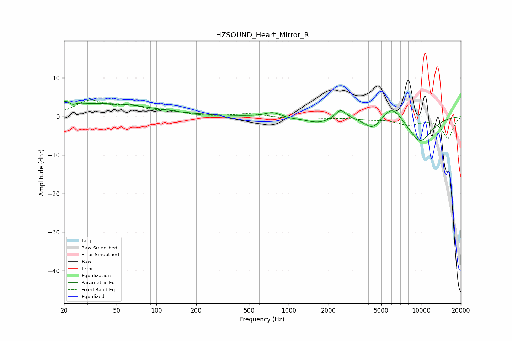

# HZSOUND_Heart_Mirror_R
See [usage instructions](https://github.com/jaakkopasanen/AutoEq#usage) for more options and info.

### Parametric EQs
Apply preamp of -4.0 dB when using parametric equalizer.

|   # | Type    |   Fc (Hz) |    Q |   Gain (dB) |
|-----|---------|-----------|------|-------------|
|   1 | Peaking |        22 | 2.41 |         2.9 |
|   2 | Peaking |        23 | 4.7  |        -1.8 |
|   3 | Peaking |        45 | 0.42 |         3.1 |
|   4 | Peaking |       757 | 2.5  |         1.2 |
|   5 | Peaking |      1045 | 2.1  |        -0.3 |
|   6 | Peaking |      1673 | 1.5  |        -1.6 |
|   7 | Peaking |      2469 | 3.54 |         2.5 |
|   8 | Peaking |      4322 | 2.17 |        -3.4 |
|   9 | Peaking |      6053 | 1.76 |         4.2 |
|  10 | Peaking |      9817 | 1.3  |        -6.8 |

### Fixed Band EQs
When using fixed band (also called graphic) equalizer, apply preamp of **-4.4 dB** (if available) and set gains manually with these parameters.

|   # | Type    |   Fc (Hz) |    Q |   Gain (dB) |
|-----|---------|-----------|------|-------------|
|   1 | Peaking |        31 | 1.41 |         3.8 |
|   2 | Peaking |        62 | 1.41 |         2.2 |
|   3 | Peaking |       125 | 1.41 |         1.1 |
|   4 | Peaking |       250 | 1.41 |        -0.1 |
|   5 | Peaking |       500 | 1.41 |         0.8 |
|   6 | Peaking |      1000 | 1.41 |        -0.5 |
|   7 | Peaking |      2000 | 1.41 |        -0.3 |
|   8 | Peaking |      4000 | 1.41 |        -0.6 |
|   9 | Peaking |      8000 | 1.41 |        -1.9 |
|  10 | Peaking |     16000 | 1.41 |        -5.6 |

### Graphs

