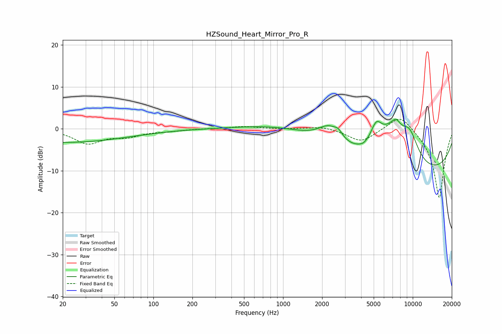

# HZSound_Heart_Mirror_Pro_R
See [usage instructions](https://github.com/jaakkopasanen/AutoEq#usage) for more options and info.

### Parametric EQs
Apply preamp of -2.4 dB when using parametric equalizer.

|   # | Type    |   Fc (Hz) |    Q |   Gain (dB) |
|-----|---------|-----------|------|-------------|
|   1 | Peaking |        20 | 0.28 |        -3.2 |
|   2 | Peaking |      1092 | 0.48 |         1.8 |
|   3 | Peaking |      2277 | 1.59 |         4.4 |
|   4 | Peaking |      2673 | 4.73 |         1.2 |
|   5 | Peaking |      4175 | 5.45 |        -0.3 |
|   6 | Peaking |      5230 | 3.15 |         4.8 |
|   7 | Peaking |      6857 | 1.12 |         8.2 |
|   8 | Peaking |      7438 | 4.06 |         1.9 |
|   9 | Peaking |      9470 | 1.8  |         6.4 |
|  10 | Peaking |      9517 | 0.19 |       -11.4 |

### Fixed Band EQs
When using fixed band (also called graphic) equalizer, apply preamp of **-2.4 dB** (if available) and set gains manually with these parameters.

|   # | Type    |   Fc (Hz) |    Q |   Gain (dB) |
|-----|---------|-----------|------|-------------|
|   1 | Peaking |        31 | 1.41 |        -3.4 |
|   2 | Peaking |        62 | 1.41 |        -1.6 |
|   3 | Peaking |       125 | 1.41 |        -0.4 |
|   4 | Peaking |       250 | 1.41 |         0   |
|   5 | Peaking |       500 | 1.41 |         0.6 |
|   6 | Peaking |      1000 | 1.41 |        -0.1 |
|   7 | Peaking |      2000 | 1.41 |         0.7 |
|   8 | Peaking |      4000 | 1.41 |        -3.1 |
|   9 | Peaking |      8000 | 1.41 |         4   |
|  10 | Peaking |     16000 | 1.41 |       -16.7 |

### Graphs

