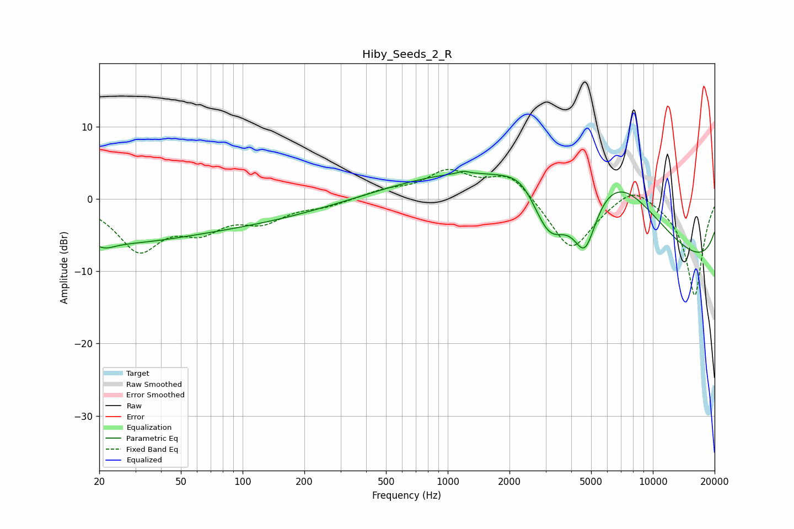

# Hiby_Seeds_2_R
See [usage instructions](https://github.com/jaakkopasanen/AutoEq#usage) for more options and info.

### Parametric EQs
Apply preamp of -3.9 dB when using parametric equalizer.

|   # | Type    |   Fc (Hz) |    Q |   Gain (dB) |
|-----|---------|-----------|------|-------------|
|   1 | Peaking |        21 | 0.41 |        -2.3 |
|   2 | Peaking |        21 | 3.01 |        -0.8 |
|   3 | Peaking |        42 | 0.18 |        -3.9 |
|   4 | Peaking |      1192 | 5.65 |         0.4 |
|   5 | Peaking |      2331 | 1.52 |         3   |
|   6 | Peaking |      3117 | 1.42 |        -8.4 |
|   7 | Peaking |      4196 | 0.19 |        10.3 |
|   8 | Peaking |      4669 | 2.32 |        -8.4 |
|   9 | Peaking |      6433 | 0.61 |         8.2 |
|  10 | Peaking |     10000 | 0.19 |       -15.1 |

### Fixed Band EQs
When using fixed band (also called graphic) equalizer, apply preamp of **-4.2 dB** (if available) and set gains manually with these parameters.

|   # | Type    |   Fc (Hz) |    Q |   Gain (dB) |
|-----|---------|-----------|------|-------------|
|   1 | Peaking |        31 | 1.41 |        -6.7 |
|   2 | Peaking |        62 | 1.41 |        -3.5 |
|   3 | Peaking |       125 | 1.41 |        -2.7 |
|   4 | Peaking |       250 | 1.41 |        -0.8 |
|   5 | Peaking |       500 | 1.41 |         1.1 |
|   6 | Peaking |      1000 | 1.41 |         3.6 |
|   7 | Peaking |      2000 | 1.41 |         3.6 |
|   8 | Peaking |      4000 | 1.41 |        -7.3 |
|   9 | Peaking |      8000 | 1.41 |         2.4 |
|  10 | Peaking |     16000 | 1.41 |       -13.4 |

### Graphs

