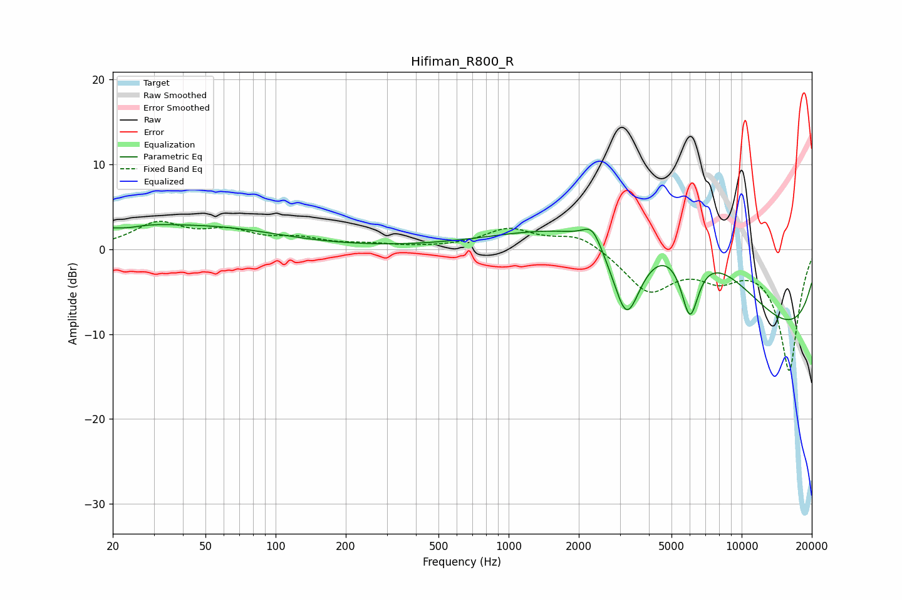

# Hifiman_R800_R
See [usage instructions](https://github.com/jaakkopasanen/AutoEq#usage) for more options and info.

### Parametric EQs
Apply preamp of -3.0 dB when using parametric equalizer.

|   # | Type    |   Fc (Hz) |    Q |   Gain (dB) |
|-----|---------|-----------|------|-------------|
|   1 | Peaking |        21 | 0.73 |         2.1 |
|   2 | Peaking |        23 | 2.34 |        -0.5 |
|   3 | Peaking |        58 | 0.5  |         2.1 |
|   4 | Peaking |      2289 | 3.5  |         2.3 |
|   5 | Peaking |      3208 | 2.09 |       -10.5 |
|   6 | Peaking |      3941 | 0.3  |         7.7 |
|   7 | Peaking |      5997 | 3.49 |        -7.9 |
|   8 | Peaking |      6967 | 0.38 |         8.9 |
|   9 | Peaking |      9619 | 0.18 |        -2.7 |
|  10 | Peaking |     10000 | 0.23 |       -13.4 |

### Fixed Band EQs
When using fixed band (also called graphic) equalizer, apply preamp of **-3.4 dB** (if available) and set gains manually with these parameters.

|   # | Type    |   Fc (Hz) |    Q |   Gain (dB) |
|-----|---------|-----------|------|-------------|
|   1 | Peaking |        31 | 1.41 |         2.9 |
|   2 | Peaking |        62 | 1.41 |         1.8 |
|   3 | Peaking |       125 | 1.41 |         1   |
|   4 | Peaking |       250 | 1.41 |         0.4 |
|   5 | Peaking |       500 | 1.41 |         0.1 |
|   6 | Peaking |      1000 | 1.41 |         2.3 |
|   7 | Peaking |      2000 | 1.41 |         1.8 |
|   8 | Peaking |      4000 | 1.41 |        -4.8 |
|   9 | Peaking |      8000 | 1.41 |        -2.7 |
|  10 | Peaking |     16000 | 1.41 |       -14.2 |

### Graphs

