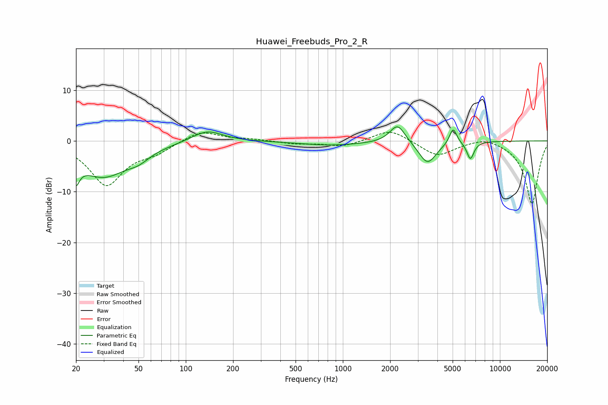

# Huawei_Freebuds_Pro_2_R
See [usage instructions](https://github.com/jaakkopasanen/AutoEq#usage) for more options and info.

### Parametric EQs
Apply preamp of -2.9 dB when using parametric equalizer.

|   # | Type    |   Fc (Hz) |    Q |   Gain (dB) |
|-----|---------|-----------|------|-------------|
|   1 | Peaking |        20 | 5.84 |        -7.4 |
|   2 | Peaking |        20 | 5.92 |         3.1 |
|   3 | Peaking |        30 | 0.85 |        -6.9 |
|   4 | Peaking |        50 | 2.16 |        -1.3 |
|   5 | Peaking |       137 | 1.43 |         2.3 |
|   6 | Peaking |       843 | 0.7  |        -0.9 |
|   7 | Peaking |      2229 | 2.91 |         3.7 |
|   8 | Peaking |      3460 | 2.53 |        -4.5 |
|   9 | Peaking |      5037 | 5.99 |         3.2 |
|  10 | Peaking |      6487 | 5.99 |        -3.4 |

### Fixed Band EQs
When using fixed band (also called graphic) equalizer, apply preamp of **-1.8 dB** (if available) and set gains manually with these parameters.

|   # | Type    |   Fc (Hz) |    Q |   Gain (dB) |
|-----|---------|-----------|------|-------------|
|   1 | Peaking |        31 | 1.41 |        -8.6 |
|   2 | Peaking |        62 | 1.41 |        -1.8 |
|   3 | Peaking |       125 | 1.41 |         2.1 |
|   4 | Peaking |       250 | 1.41 |         0.3 |
|   5 | Peaking |       500 | 1.41 |        -0.5 |
|   6 | Peaking |      1000 | 1.41 |        -1.1 |
|   7 | Peaking |      2000 | 1.41 |         2.4 |
|   8 | Peaking |      4000 | 1.41 |        -3   |
|   9 | Peaking |      8000 | 1.41 |         1   |
|  10 | Peaking |     16000 | 1.41 |       -12.5 |

### Graphs

