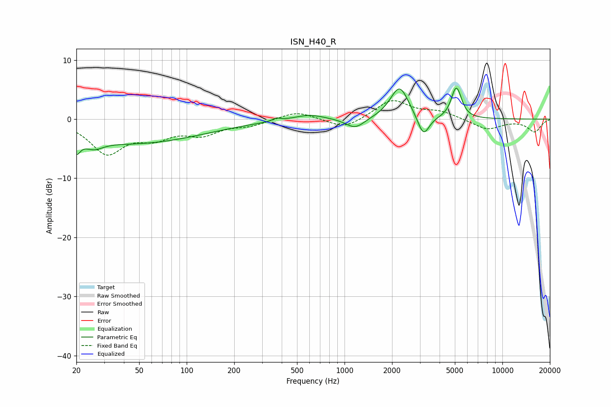

# ISN_H40_R
See [usage instructions](https://github.com/jaakkopasanen/AutoEq#usage) for more options and info.

### Parametric EQs
Apply preamp of -5.4 dB when using parametric equalizer.

|   # | Type    |   Fc (Hz) |    Q |   Gain (dB) |
|-----|---------|-----------|------|-------------|
|   1 | Peaking |        20 | 5.87 |        -2.4 |
|   2 | Peaking |        26 | 2.48 |        -1.4 |
|   3 | Peaking |        45 | 0.31 |        -4   |
|   4 | Peaking |       370 | 5.98 |         0.5 |
|   5 | Peaking |       596 | 1.47 |         0.9 |
|   6 | Peaking |      1168 | 2.35 |        -1.8 |
|   7 | Peaking |      2232 | 2.39 |         5.6 |
|   8 | Peaking |      3161 | 3.78 |        -3.7 |
|   9 | Peaking |      5044 | 4.76 |         3.9 |
|  10 | Peaking |      5292 | 4.98 |         1.6 |

### Fixed Band EQs
When using fixed band (also called graphic) equalizer, apply preamp of **-3.2 dB** (if available) and set gains manually with these parameters.

|   # | Type    |   Fc (Hz) |    Q |   Gain (dB) |
|-----|---------|-----------|------|-------------|
|   1 | Peaking |        31 | 1.41 |        -5.5 |
|   2 | Peaking |        62 | 1.41 |        -2.6 |
|   3 | Peaking |       125 | 1.41 |        -2.2 |
|   4 | Peaking |       250 | 1.41 |        -1   |
|   5 | Peaking |       500 | 1.41 |         1.4 |
|   6 | Peaking |      1000 | 1.41 |        -1.8 |
|   7 | Peaking |      2000 | 1.41 |         3.2 |
|   8 | Peaking |      4000 | 1.41 |         1.2 |
|   9 | Peaking |      8000 | 1.41 |        -1.8 |
|  10 | Peaking |     16000 | 1.41 |        -2.1 |

### Graphs

