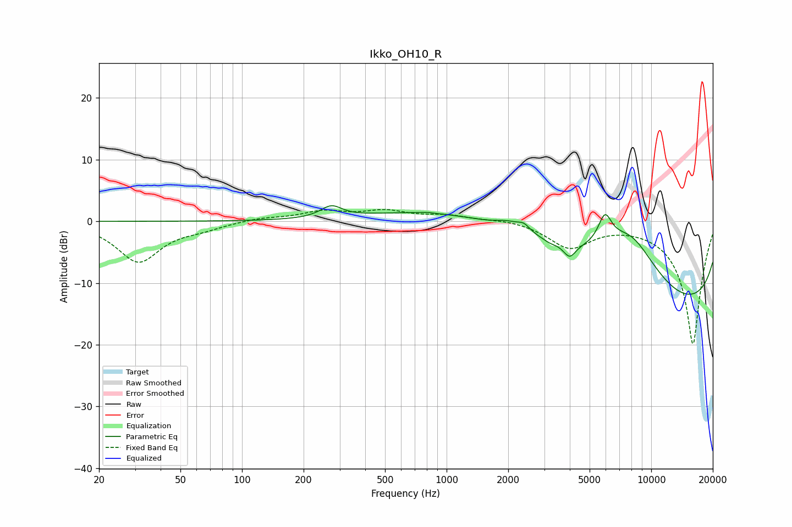

# Ikko_OH10_R
See [usage instructions](https://github.com/jaakkopasanen/AutoEq#usage) for more options and info.

### Parametric EQs
Apply preamp of -2.6 dB when using parametric equalizer.

|   # | Type    |   Fc (Hz) |    Q |   Gain (dB) |
|-----|---------|-----------|------|-------------|
|   1 | Peaking |       273 | 2.73 |         1.9 |
|   2 | Peaking |       803 | 5.98 |         0.1 |
|   3 | Peaking |      2006 | 2.16 |         1.2 |
|   4 | Peaking |      2387 | 4.51 |         1.2 |
|   5 | Peaking |      3191 | 5.34 |        -0.3 |
|   6 | Peaking |      3436 | 0.19 |         7.8 |
|   7 | Peaking |      3993 | 4.74 |        -2.2 |
|   8 | Peaking |      5941 | 4.17 |         4.5 |
|   9 | Peaking |      7894 | 0.86 |         9.5 |
|  10 | Peaking |      9638 | 0.18 |       -19.3 |

### Fixed Band EQs
When using fixed band (also called graphic) equalizer, apply preamp of **-2.0 dB** (if available) and set gains manually with these parameters.

|   # | Type    |   Fc (Hz) |    Q |   Gain (dB) |
|-----|---------|-----------|------|-------------|
|   1 | Peaking |        31 | 1.41 |        -6.5 |
|   2 | Peaking |        62 | 1.41 |        -0.9 |
|   3 | Peaking |       125 | 1.41 |         0.6 |
|   4 | Peaking |       250 | 1.41 |         1.5 |
|   5 | Peaking |       500 | 1.41 |         1.5 |
|   6 | Peaking |      1000 | 1.41 |         0.9 |
|   7 | Peaking |      2000 | 1.41 |         0.4 |
|   8 | Peaking |      4000 | 1.41 |        -4.1 |
|   9 | Peaking |      8000 | 1.41 |        -0   |
|  10 | Peaking |     16000 | 1.41 |       -20   |

### Graphs

