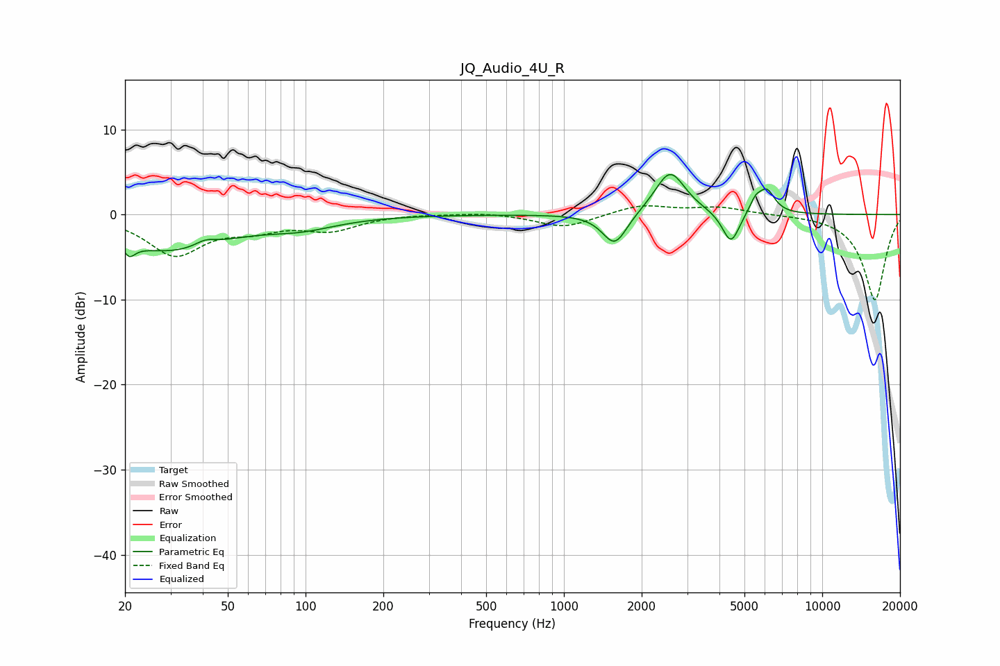

# JQ_Audio_4U_R
See [usage instructions](https://github.com/jaakkopasanen/AutoEq#usage) for more options and info.

### Parametric EQs
Apply preamp of -4.8 dB when using parametric equalizer.

|   # | Type    |   Fc (Hz) |    Q |   Gain (dB) |
|-----|---------|-----------|------|-------------|
|   1 | Peaking |        21 | 5.89 |         3.1 |
|   2 | Peaking |        21 | 5.94 |        -4.5 |
|   3 | Peaking |        29 | 0.65 |        -4.1 |
|   4 | Peaking |        41 | 3.61 |         0.7 |
|   5 | Peaking |        96 | 1.01 |        -1.2 |
|   6 | Peaking |      1574 | 2.96 |        -3.8 |
|   7 | Peaking |      2576 | 2.39 |         5.2 |
|   8 | Peaking |      4431 | 4.22 |        -3.8 |
|   9 | Peaking |      5512 | 6    |         1.4 |
|  10 | Peaking |      6099 | 4.36 |         2.7 |

### Fixed Band EQs
When using fixed band (also called graphic) equalizer, apply preamp of **-1.1 dB** (if available) and set gains manually with these parameters.

|   # | Type    |   Fc (Hz) |    Q |   Gain (dB) |
|-----|---------|-----------|------|-------------|
|   1 | Peaking |        31 | 1.41 |        -4.6 |
|   2 | Peaking |        62 | 1.41 |        -1.4 |
|   3 | Peaking |       125 | 1.41 |        -1.7 |
|   4 | Peaking |       250 | 1.41 |         0.1 |
|   5 | Peaking |       500 | 1.41 |         0.3 |
|   6 | Peaking |      1000 | 1.41 |        -1.6 |
|   7 | Peaking |      2000 | 1.41 |         1.2 |
|   8 | Peaking |      4000 | 1.41 |         0.8 |
|   9 | Peaking |      8000 | 1.41 |         0   |
|  10 | Peaking |     16000 | 1.41 |       -10.1 |

### Graphs

