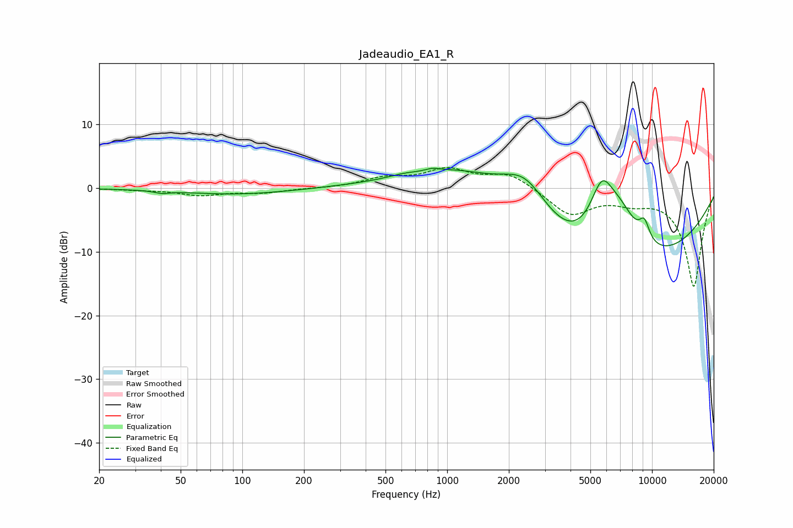

# Jadeaudio_EA1_R
See [usage instructions](https://github.com/jaakkopasanen/AutoEq#usage) for more options and info.

### Parametric EQs
Apply preamp of -3.2 dB when using parametric equalizer.

|   # | Type    |   Fc (Hz) |    Q |   Gain (dB) |
|-----|---------|-----------|------|-------------|
|   1 | Peaking |        41 | 4.05 |        -0.4 |
|   2 | Peaking |        94 | 0.54 |        -1   |
|   3 | Peaking |       615 | 2.09 |         0.4 |
|   4 | Peaking |       847 | 4.47 |         0.4 |
|   5 | Peaking |      1197 | 0.5  |         7.8 |
|   6 | Peaking |      2411 | 1.03 |         8.3 |
|   7 | Peaking |      5392 | 0.23 |       -16.4 |
|   8 | Peaking |      5681 | 2.14 |         9   |
|   9 | Peaking |      6985 | 1.32 |         7.8 |
|  10 | Peaking |      9171 | 4.93 |         3.1 |

### Fixed Band EQs
When using fixed band (also called graphic) equalizer, apply preamp of **-3.3 dB** (if available) and set gains manually with these parameters.

|   # | Type    |   Fc (Hz) |    Q |   Gain (dB) |
|-----|---------|-----------|------|-------------|
|   1 | Peaking |        31 | 1.41 |        -0.2 |
|   2 | Peaking |        62 | 1.41 |        -1.1 |
|   3 | Peaking |       125 | 1.41 |        -0.7 |
|   4 | Peaking |       250 | 1.41 |        -0   |
|   5 | Peaking |       500 | 1.41 |         1.4 |
|   6 | Peaking |      1000 | 1.41 |         2.7 |
|   7 | Peaking |      2000 | 1.41 |         2.3 |
|   8 | Peaking |      4000 | 1.41 |        -4.1 |
|   9 | Peaking |      8000 | 1.41 |        -1.6 |
|  10 | Peaking |     16000 | 1.41 |       -15.4 |

### Graphs

