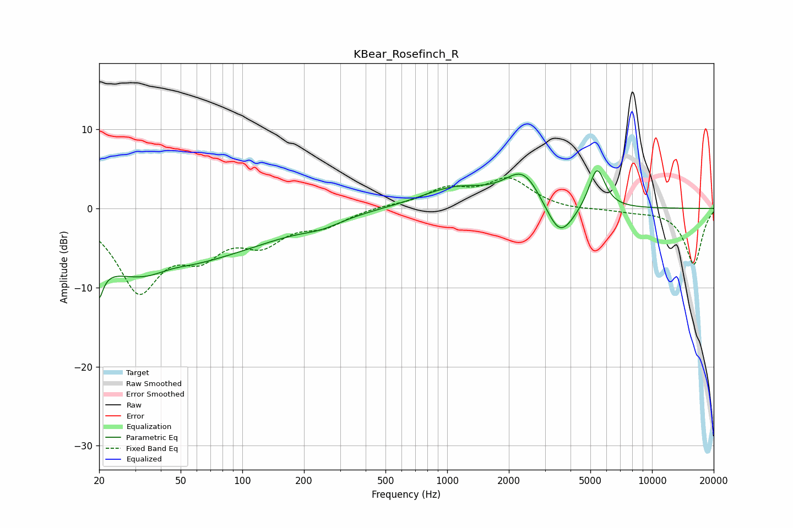

# KBear_Rosefinch_R
See [usage instructions](https://github.com/jaakkopasanen/AutoEq#usage) for more options and info.

### Parametric EQs
Apply preamp of -4.9 dB when using parametric equalizer.

|   # | Type    |   Fc (Hz) |    Q |   Gain (dB) |
|-----|---------|-----------|------|-------------|
|   1 | Peaking |        20 | 5.58 |        -8   |
|   2 | Peaking |        20 | 5.77 |         3.3 |
|   3 | Peaking |        32 | 0.49 |        -8.2 |
|   4 | Peaking |        45 | 1.44 |         1   |
|   5 | Peaking |       105 | 0.5  |        -2.5 |
|   6 | Peaking |       244 | 1.37 |        -0.9 |
|   7 | Peaking |      1087 | 0.85 |         2.5 |
|   8 | Peaking |      2360 | 1.56 |         4.6 |
|   9 | Peaking |      3545 | 1.97 |        -4.8 |
|  10 | Peaking |      5385 | 3.48 |         5.3 |

### Fixed Band EQs
When using fixed band (also called graphic) equalizer, apply preamp of **-4.0 dB** (if available) and set gains manually with these parameters.

|   # | Type    |   Fc (Hz) |    Q |   Gain (dB) |
|-----|---------|-----------|------|-------------|
|   1 | Peaking |        31 | 1.41 |        -9.9 |
|   2 | Peaking |        62 | 1.41 |        -4.5 |
|   3 | Peaking |       125 | 1.41 |        -3.7 |
|   4 | Peaking |       250 | 1.41 |        -1.9 |
|   5 | Peaking |       500 | 1.41 |         0.3 |
|   6 | Peaking |      1000 | 1.41 |         2.2 |
|   7 | Peaking |      2000 | 1.41 |         3.5 |
|   8 | Peaking |      4000 | 1.41 |        -0.3 |
|   9 | Peaking |      8000 | 1.41 |        -0.3 |
|  10 | Peaking |     16000 | 1.41 |        -7.1 |

### Graphs

