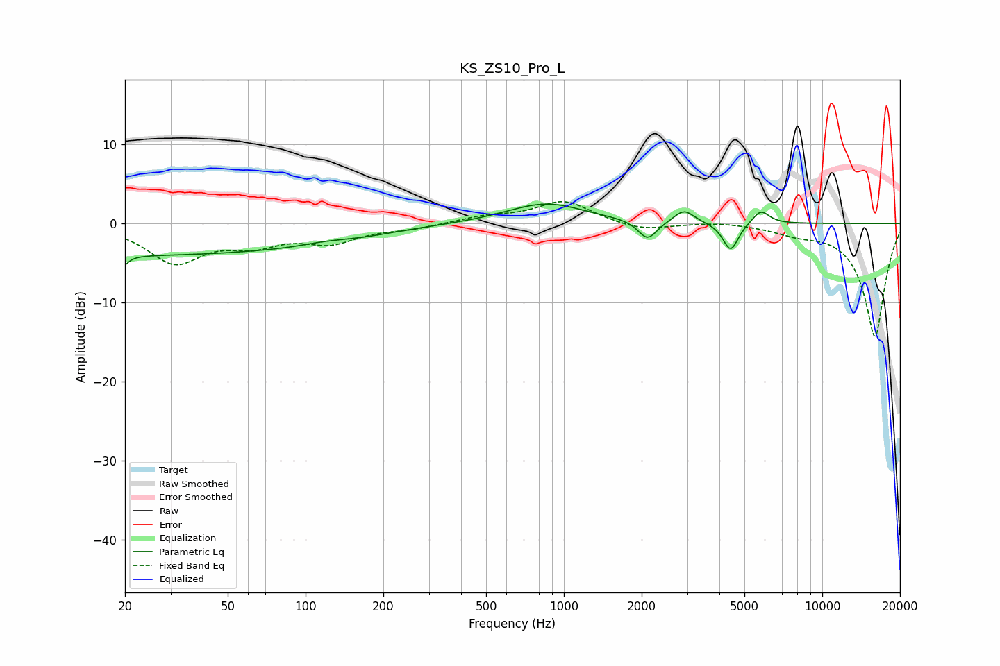

# KS_ZS10_Pro_L
See [usage instructions](https://github.com/jaakkopasanen/AutoEq#usage) for more options and info.

### Parametric EQs
Apply preamp of -2.6 dB when using parametric equalizer.

|   # | Type    |   Fc (Hz) |    Q |   Gain (dB) |
|-----|---------|-----------|------|-------------|
|   1 | Peaking |        20 | 5.94 |        -3.9 |
|   2 | Peaking |        20 | 5.98 |         2.7 |
|   3 | Peaking |        21 | 0.19 |        -3.9 |
|   4 | Peaking |       120 | 1.43 |         0.6 |
|   5 | Peaking |       128 | 0.72 |        -1   |
|   6 | Peaking |       851 | 0.94 |         2.6 |
|   7 | Peaking |      2108 | 3.92 |        -2.5 |
|   8 | Peaking |      2919 | 3.67 |         1.7 |
|   9 | Peaking |      4421 | 4.77 |        -3.6 |
|  10 | Peaking |      5787 | 4.28 |         1.8 |

### Fixed Band EQs
When using fixed band (also called graphic) equalizer, apply preamp of **-2.9 dB** (if available) and set gains manually with these parameters.

|   # | Type    |   Fc (Hz) |    Q |   Gain (dB) |
|-----|---------|-----------|------|-------------|
|   1 | Peaking |        31 | 1.41 |        -4.7 |
|   2 | Peaking |        62 | 1.41 |        -2.2 |
|   3 | Peaking |       125 | 1.41 |        -2.2 |
|   4 | Peaking |       250 | 1.41 |        -0.6 |
|   5 | Peaking |       500 | 1.41 |         0.8 |
|   6 | Peaking |      1000 | 1.41 |         2.8 |
|   7 | Peaking |      2000 | 1.41 |        -1   |
|   8 | Peaking |      4000 | 1.41 |         0.3 |
|   9 | Peaking |      8000 | 1.41 |        -0.9 |
|  10 | Peaking |     16000 | 1.41 |       -14.3 |

### Graphs

