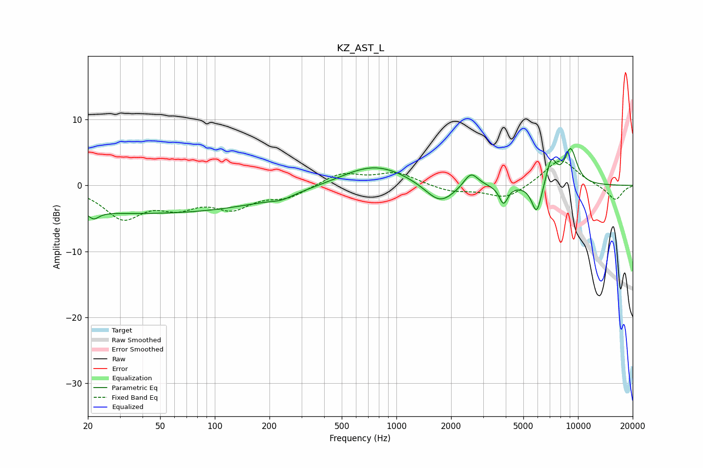

# KZ_AST_L
See [usage instructions](https://github.com/jaakkopasanen/AutoEq#usage) for more options and info.

### Parametric EQs
Apply preamp of -5.7 dB when using parametric equalizer.

|   # | Type    |   Fc (Hz) |    Q |   Gain (dB) |
|-----|---------|-----------|------|-------------|
|   1 | Peaking |        22 | 5.01 |        -1.1 |
|   2 | Peaking |        41 | 0.18 |        -4.2 |
|   3 | Peaking |       233 | 2.35 |        -0.6 |
|   4 | Peaking |       757 | 0.77 |         3.3 |
|   5 | Peaking |      1738 | 1.71 |        -3.3 |
|   6 | Peaking |      2573 | 3.57 |         2.3 |
|   7 | Peaking |      3887 | 6    |        -2.8 |
|   8 | Peaking |      5923 | 4.9  |        -4.7 |
|   9 | Peaking |      7126 | 4.72 |         3.9 |
|  10 | Peaking |      9107 | 3.63 |         5.4 |

### Fixed Band EQs
When using fixed band (also called graphic) equalizer, apply preamp of **-3.8 dB** (if available) and set gains manually with these parameters.

|   # | Type    |   Fc (Hz) |    Q |   Gain (dB) |
|-----|---------|-----------|------|-------------|
|   1 | Peaking |        31 | 1.41 |        -4.7 |
|   2 | Peaking |        62 | 1.41 |        -2.6 |
|   3 | Peaking |       125 | 1.41 |        -3   |
|   4 | Peaking |       250 | 1.41 |        -1.7 |
|   5 | Peaking |       500 | 1.41 |         1.9 |
|   6 | Peaking |      1000 | 1.41 |         1.9 |
|   7 | Peaking |      2000 | 1.41 |        -0.9 |
|   8 | Peaking |      4000 | 1.41 |        -2.1 |
|   9 | Peaking |      8000 | 1.41 |         4.1 |
|  10 | Peaking |     16000 | 1.41 |        -2.3 |

### Graphs

