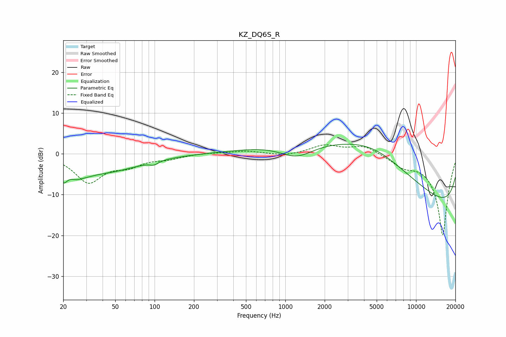

# KZ_DQ6S_R
See [usage instructions](https://github.com/jaakkopasanen/AutoEq#usage) for more options and info.

### Parametric EQs
Apply preamp of -2.4 dB when using parametric equalizer.

|   # | Type    |   Fc (Hz) |    Q |   Gain (dB) |
|-----|---------|-----------|------|-------------|
|   1 | Peaking |        20 | 4.69 |        -3.8 |
|   2 | Peaking |        21 | 1.1  |         1.2 |
|   3 | Peaking |        26 | 1.74 |        -3.9 |
|   4 | Peaking |        28 | 3.8  |         0.4 |
|   5 | Peaking |        42 | 0.54 |        -4.1 |
|   6 | Peaking |        99 | 4.55 |        -0.8 |
|   7 | Peaking |      1223 | 1.03 |        -4.1 |
|   8 | Peaking |      4630 | 0.28 |        17.2 |
|   9 | Peaking |     10000 | 0.18 |        -6.8 |
|  10 | Peaking |     10000 | 0.18 |       -11.7 |

### Fixed Band EQs
When using fixed band (also called graphic) equalizer, apply preamp of **-2.3 dB** (if available) and set gains manually with these parameters.

|   # | Type    |   Fc (Hz) |    Q |   Gain (dB) |
|-----|---------|-----------|------|-------------|
|   1 | Peaking |        31 | 1.41 |        -6.8 |
|   2 | Peaking |        62 | 1.41 |        -2.4 |
|   3 | Peaking |       125 | 1.41 |        -1   |
|   4 | Peaking |       250 | 1.41 |         0.2 |
|   5 | Peaking |       500 | 1.41 |         0.7 |
|   6 | Peaking |      1000 | 1.41 |        -0.6 |
|   7 | Peaking |      2000 | 1.41 |         2.1 |
|   8 | Peaking |      4000 | 1.41 |         2.1 |
|   9 | Peaking |      8000 | 1.41 |        -2.3 |
|  10 | Peaking |     16000 | 1.41 |       -20   |

### Graphs

