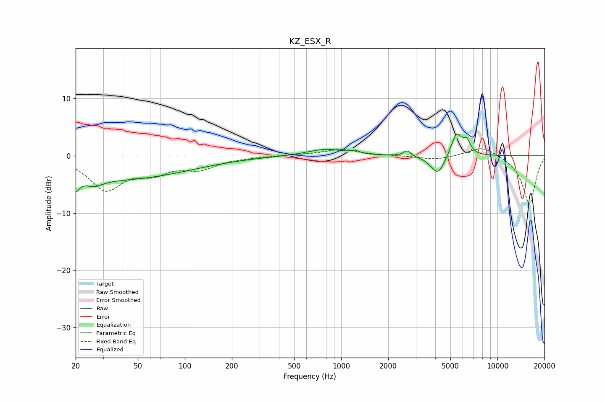

# KZ_ESX_R
See [usage instructions](https://github.com/jaakkopasanen/AutoEq#usage) for more options and info.

### Parametric EQs
Apply preamp of -3.9 dB when using parametric equalizer.

|   # | Type    |   Fc (Hz) |    Q |   Gain (dB) |
|-----|---------|-----------|------|-------------|
|   1 | Peaking |        20 | 5.88 |        -2.4 |
|   2 | Peaking |        26 | 2.3  |        -1.4 |
|   3 | Peaking |        39 | 0.32 |        -4   |
|   4 | Peaking |       801 | 1.2  |         1.2 |
|   5 | Peaking |      1231 | 6    |         0.5 |
|   6 | Peaking |      2664 | 5.93 |         1.6 |
|   7 | Peaking |      2704 | 6    |        -0.6 |
|   8 | Peaking |      4161 | 3.07 |        -3.5 |
|   9 | Peaking |      5468 | 3.89 |         4.1 |
|  10 | Peaking |      6370 | 6    |         2   |

### Fixed Band EQs
When using fixed band (also called graphic) equalizer, apply preamp of **-1.3 dB** (if available) and set gains manually with these parameters.

|   # | Type    |   Fc (Hz) |    Q |   Gain (dB) |
|-----|---------|-----------|------|-------------|
|   1 | Peaking |        31 | 1.41 |        -5.7 |
|   2 | Peaking |        62 | 1.41 |        -2.4 |
|   3 | Peaking |       125 | 1.41 |        -2   |
|   4 | Peaking |       250 | 1.41 |        -0.2 |
|   5 | Peaking |       500 | 1.41 |         0.2 |
|   6 | Peaking |      1000 | 1.41 |         1.1 |
|   7 | Peaking |      2000 | 1.41 |         0   |
|   8 | Peaking |      4000 | 1.41 |        -0.7 |
|   9 | Peaking |      8000 | 1.41 |         1.8 |
|  10 | Peaking |     16000 | 1.41 |        -8.5 |

### Graphs

