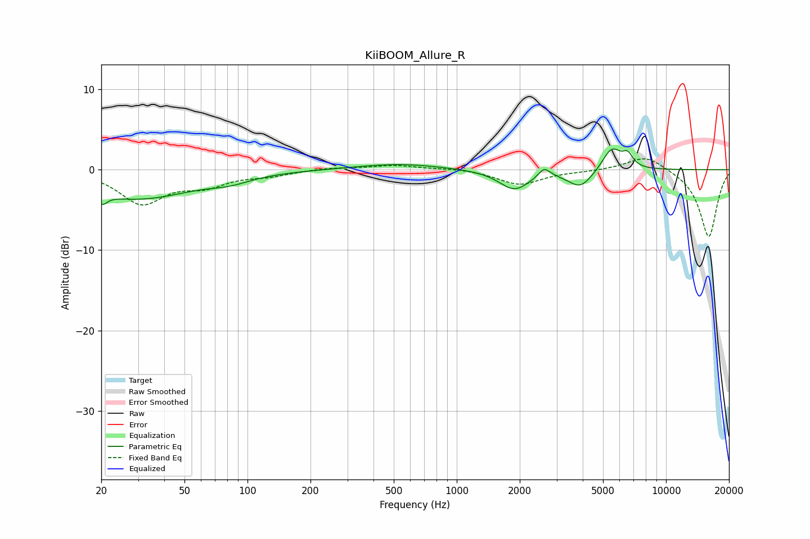

# KiiBOOM_Allure_R
See [usage instructions](https://github.com/jaakkopasanen/AutoEq#usage) for more options and info.

### Parametric EQs
Apply preamp of -2.7 dB when using parametric equalizer.

|   # | Type    |   Fc (Hz) |    Q |   Gain (dB) |
|-----|---------|-----------|------|-------------|
|   1 | Peaking |        20 | 6    |         2.6 |
|   2 | Peaking |        20 | 6    |        -3.9 |
|   3 | Peaking |        30 | 0.53 |        -3.6 |
|   4 | Peaking |        83 | 1.43 |        -0.7 |
|   5 | Peaking |       528 | 0.71 |         0.7 |
|   6 | Peaking |      1885 | 1.94 |        -2.5 |
|   7 | Peaking |      2618 | 5.19 |         1.2 |
|   8 | Peaking |      3896 | 2.37 |        -2.2 |
|   9 | Peaking |      5507 | 3.04 |         2.9 |
|  10 | Peaking |      6564 | 5.47 |         1.5 |

### Fixed Band EQs
When using fixed band (also called graphic) equalizer, apply preamp of **-1.5 dB** (if available) and set gains manually with these parameters.

|   # | Type    |   Fc (Hz) |    Q |   Gain (dB) |
|-----|---------|-----------|------|-------------|
|   1 | Peaking |        31 | 1.41 |        -4.1 |
|   2 | Peaking |        62 | 1.41 |        -1.7 |
|   3 | Peaking |       125 | 1.41 |        -0.6 |
|   4 | Peaking |       250 | 1.41 |         0.3 |
|   5 | Peaking |       500 | 1.41 |         0.6 |
|   6 | Peaking |      1000 | 1.41 |         0.2 |
|   7 | Peaking |      2000 | 1.41 |        -1.9 |
|   8 | Peaking |      4000 | 1.41 |        -0.1 |
|   9 | Peaking |      8000 | 1.41 |         1.9 |
|  10 | Peaking |     16000 | 1.41 |        -8.4 |

### Graphs

