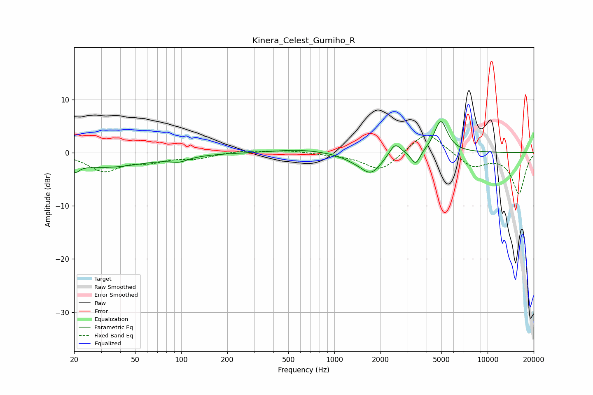

# Kinera_Celest_Gumiho_R
See [usage instructions](https://github.com/jaakkopasanen/AutoEq#usage) for more options and info.

### Parametric EQs
Apply preamp of -5.9 dB when using parametric equalizer.

|   # | Type    |   Fc (Hz) |    Q |   Gain (dB) |
|-----|---------|-----------|------|-------------|
|   1 | Peaking |        20 | 6    |         1.9 |
|   2 | Peaking |        20 | 5.98 |        -3.2 |
|   3 | Peaking |        30 | 0.46 |        -2.7 |
|   4 | Peaking |        97 | 2.52 |        -0.8 |
|   5 | Peaking |       587 | 0.9  |         0.6 |
|   6 | Peaking |      1333 | 1.8  |        -0.7 |
|   7 | Peaking |      1735 | 2.07 |        -3.7 |
|   8 | Peaking |      2489 | 3.86 |         2.4 |
|   9 | Peaking |      3396 | 4.84 |        -2.6 |
|  10 | Peaking |      4948 | 3.23 |         6.1 |

### Fixed Band EQs
When using fixed band (also called graphic) equalizer, apply preamp of **-3.3 dB** (if available) and set gains manually with these parameters.

|   # | Type    |   Fc (Hz) |    Q |   Gain (dB) |
|-----|---------|-----------|------|-------------|
|   1 | Peaking |        31 | 1.41 |        -3.3 |
|   2 | Peaking |        62 | 1.41 |        -1.4 |
|   3 | Peaking |       125 | 1.41 |        -1   |
|   4 | Peaking |       250 | 1.41 |         0.4 |
|   5 | Peaking |       500 | 1.41 |         0.4 |
|   6 | Peaking |      1000 | 1.41 |        -0.3 |
|   7 | Peaking |      2000 | 1.41 |        -3.5 |
|   8 | Peaking |      4000 | 1.41 |         4.3 |
|   9 | Peaking |      8000 | 1.41 |        -2.7 |
|  10 | Peaking |     16000 | 1.41 |        -7.6 |

### Graphs

