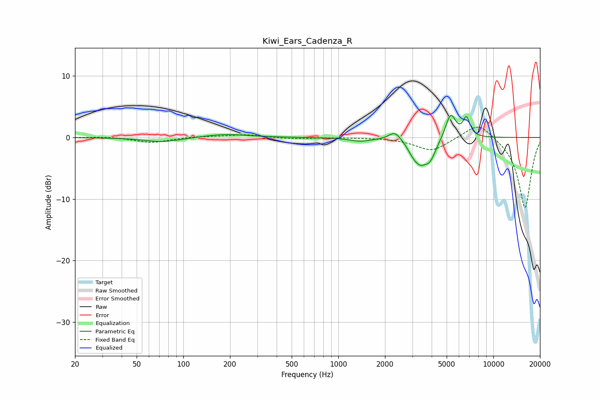

# Kiwi_Ears_Cadenza_R
See [usage instructions](https://github.com/jaakkopasanen/AutoEq#usage) for more options and info.

### Parametric EQs
Apply preamp of -3.7 dB when using parametric equalizer.

|   # | Type    |   Fc (Hz) |    Q |   Gain (dB) |
|-----|---------|-----------|------|-------------|
|   1 | Peaking |        73 | 1.21 |        -0.8 |
|   2 | Peaking |       186 | 1.02 |         0.6 |
|   3 | Peaking |      1380 | 2.07 |        -0.5 |
|   4 | Peaking |      2314 | 3.64 |         1.5 |
|   5 | Peaking |      2868 | 2.67 |         0.7 |
|   6 | Peaking |      2942 | 5.52 |        -0.5 |
|   7 | Peaking |      3320 | 2.36 |        -4.4 |
|   8 | Peaking |      3932 | 4.02 |        -2   |
|   9 | Peaking |      5304 | 4.12 |         4.2 |
|  10 | Peaking |      6707 | 6    |         3   |

### Fixed Band EQs
When using fixed band (also called graphic) equalizer, apply preamp of **-1.8 dB** (if available) and set gains manually with these parameters.

|   # | Type    |   Fc (Hz) |    Q |   Gain (dB) |
|-----|---------|-----------|------|-------------|
|   1 | Peaking |        31 | 1.41 |         0.1 |
|   2 | Peaking |        62 | 1.41 |        -0.8 |
|   3 | Peaking |       125 | 1.41 |         0.2 |
|   4 | Peaking |       250 | 1.41 |         0.5 |
|   5 | Peaking |       500 | 1.41 |        -0.2 |
|   6 | Peaking |      1000 | 1.41 |         0   |
|   7 | Peaking |      2000 | 1.41 |        -0   |
|   8 | Peaking |      4000 | 1.41 |        -2.2 |
|   9 | Peaking |      8000 | 1.41 |         2.7 |
|  10 | Peaking |     16000 | 1.41 |       -11.6 |

### Graphs

