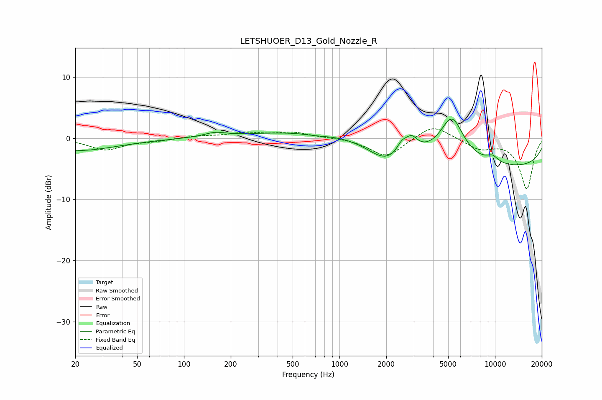

# LETSHUOER_D13_Gold_Nozzle_R
See [usage instructions](https://github.com/jaakkopasanen/AutoEq#usage) for more options and info.

### Parametric EQs
Apply preamp of -3.2 dB when using parametric equalizer.

|   # | Type    |   Fc (Hz) |    Q |   Gain (dB) |
|-----|---------|-----------|------|-------------|
|   1 | Peaking |        20 | 0.53 |        -2   |
|   2 | Peaking |       158 | 2.08 |         0.7 |
|   3 | Peaking |       707 | 1.77 |        -0.3 |
|   4 | Peaking |      1389 | 0.18 |         1.5 |
|   5 | Peaking |      1971 | 1.27 |        -2.9 |
|   6 | Peaking |      2522 | 4.3  |         1.6 |
|   7 | Peaking |      2910 | 3.66 |         2.2 |
|   8 | Peaking |      5285 | 1.88 |         6.7 |
|   9 | Peaking |      9636 | 3.27 |         1   |
|  10 | Peaking |      9950 | 0.18 |        -5   |

### Fixed Band EQs
When using fixed band (also called graphic) equalizer, apply preamp of **-1.6 dB** (if available) and set gains manually with these parameters.

|   # | Type    |   Fc (Hz) |    Q |   Gain (dB) |
|-----|---------|-----------|------|-------------|
|   1 | Peaking |        31 | 1.41 |        -1.9 |
|   2 | Peaking |        62 | 1.41 |        -0.4 |
|   3 | Peaking |       125 | 1.41 |         0.3 |
|   4 | Peaking |       250 | 1.41 |         0.8 |
|   5 | Peaking |       500 | 1.41 |         0.9 |
|   6 | Peaking |      1000 | 1.41 |         0.1 |
|   7 | Peaking |      2000 | 1.41 |        -3.1 |
|   8 | Peaking |      4000 | 1.41 |         2.4 |
|   9 | Peaking |      8000 | 1.41 |        -1.7 |
|  10 | Peaking |     16000 | 1.41 |        -8.2 |

### Graphs

