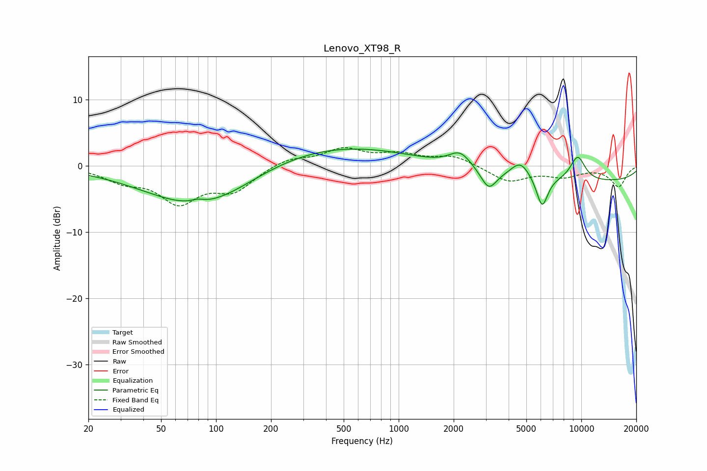

# Lenovo_XT98_R
See [usage instructions](https://github.com/jaakkopasanen/AutoEq#usage) for more options and info.

### Parametric EQs
Apply preamp of -2.6 dB when using parametric equalizer.

|   # | Type    |   Fc (Hz) |    Q |   Gain (dB) |
|-----|---------|-----------|------|-------------|
|   1 | Peaking |        79 | 3.93 |         0.5 |
|   2 | Peaking |        83 | 0.45 |        -5.6 |
|   3 | Peaking |        93 | 0.56 |        -1.5 |
|   4 | Peaking |       356 | 0.27 |         3.6 |
|   5 | Peaking |      2172 | 2.27 |         2.5 |
|   6 | Peaking |      3112 | 3.37 |        -2.9 |
|   7 | Peaking |      4642 | 2.58 |         2.6 |
|   8 | Peaking |      6101 | 4.39 |        -4.6 |
|   9 | Peaking |      9555 | 2.96 |         3.8 |
|  10 | Peaking |      9797 | 0.18 |        -2.4 |

### Fixed Band EQs
When using fixed band (also called graphic) equalizer, apply preamp of **-2.9 dB** (if available) and set gains manually with these parameters.

|   # | Type    |   Fc (Hz) |    Q |   Gain (dB) |
|-----|---------|-----------|------|-------------|
|   1 | Peaking |        31 | 1.41 |        -1.9 |
|   2 | Peaking |        62 | 1.41 |        -5.1 |
|   3 | Peaking |       125 | 1.41 |        -3.4 |
|   4 | Peaking |       250 | 1.41 |         1.2 |
|   5 | Peaking |       500 | 1.41 |         2.4 |
|   6 | Peaking |      1000 | 1.41 |         1.5 |
|   7 | Peaking |      2000 | 1.41 |         1.5 |
|   8 | Peaking |      4000 | 1.41 |        -2.3 |
|   9 | Peaking |      8000 | 1.41 |        -1.4 |
|  10 | Peaking |     16000 | 1.41 |        -3.1 |

### Graphs

