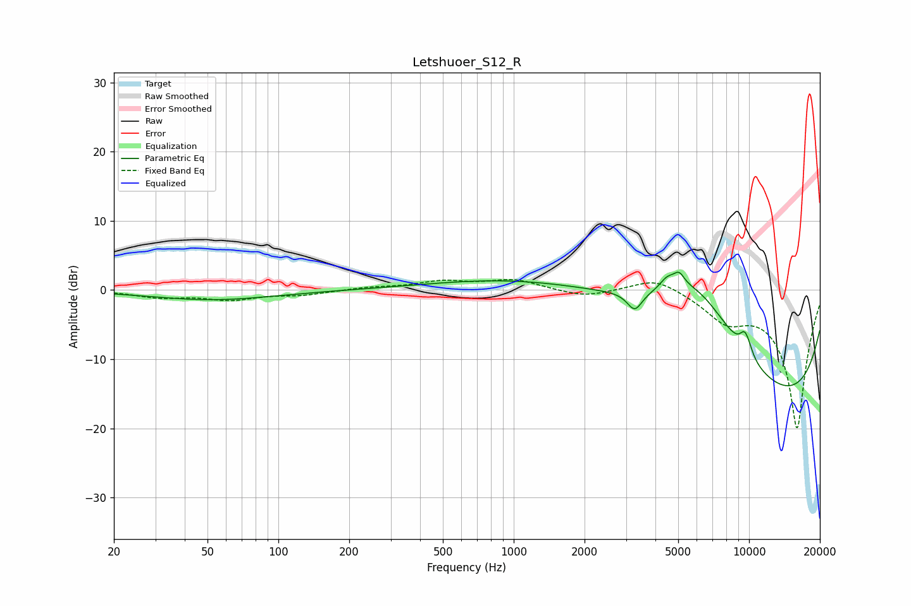

# Letshuoer_S12_R
See [usage instructions](https://github.com/jaakkopasanen/AutoEq#usage) for more options and info.

### Parametric EQs
Apply preamp of -2.7 dB when using parametric equalizer.

|   # | Type    |   Fc (Hz) |    Q |   Gain (dB) |
|-----|---------|-----------|------|-------------|
|   1 | Peaking |        52 | 0.54 |        -1.4 |
|   2 | Peaking |      2881 | 0.27 |        10.4 |
|   3 | Peaking |      3269 | 4.43 |        -2.7 |
|   4 | Peaking |      4488 | 4.43 |         1.5 |
|   5 | Peaking |      5042 | 5.92 |         1.8 |
|   6 | Peaking |      6020 | 0.64 |        12.7 |
|   7 | Peaking |      8103 | 0.18 |       -16.7 |
|   8 | Peaking |      9056 | 0.18 |        -5.4 |
|   9 | Peaking |      9573 | 5.74 |         2.5 |
|  10 | Peaking |     10000 | 5.84 |         0.8 |

### Fixed Band EQs
When using fixed band (also called graphic) equalizer, apply preamp of **-1.6 dB** (if available) and set gains manually with these parameters.

|   # | Type    |   Fc (Hz) |    Q |   Gain (dB) |
|-----|---------|-----------|------|-------------|
|   1 | Peaking |        31 | 1.41 |        -1   |
|   2 | Peaking |        62 | 1.41 |        -1.3 |
|   3 | Peaking |       125 | 1.41 |        -0.6 |
|   4 | Peaking |       250 | 1.41 |         0.4 |
|   5 | Peaking |       500 | 1.41 |         1.2 |
|   6 | Peaking |      1000 | 1.41 |         1.4 |
|   7 | Peaking |      2000 | 1.41 |        -1   |
|   8 | Peaking |      4000 | 1.41 |         2   |
|   9 | Peaking |      8000 | 1.41 |        -3.6 |
|  10 | Peaking |     16000 | 1.41 |       -20   |

### Graphs

