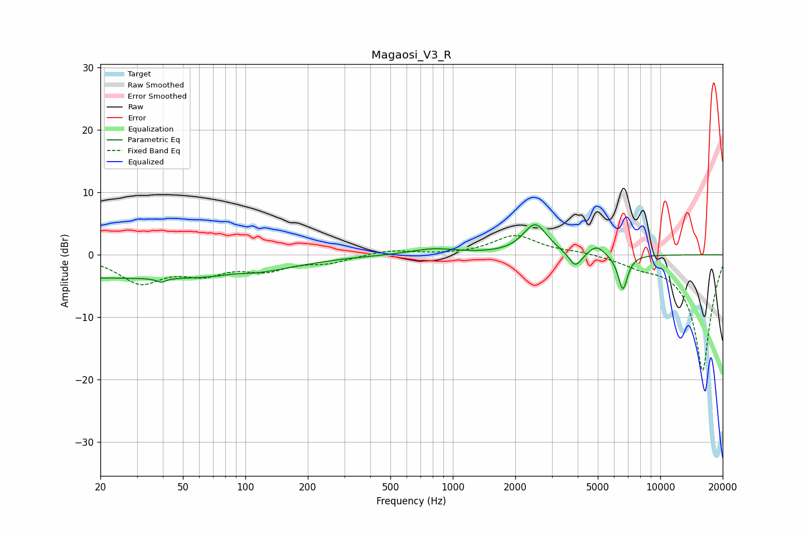

# Magaosi_V3_R
See [usage instructions](https://github.com/jaakkopasanen/AutoEq#usage) for more options and info.

### Parametric EQs
Apply preamp of -4.9 dB when using parametric equalizer.

|   # | Type    |   Fc (Hz) |    Q |   Gain (dB) |
|-----|---------|-----------|------|-------------|
|   1 | Peaking |        20 | 0.19 |        -3.6 |
|   2 | Peaking |        40 | 6    |        -3.8 |
|   3 | Peaking |        40 | 5.95 |         3.1 |
|   4 | Peaking |        88 | 1.99 |         0.5 |
|   5 | Peaking |       105 | 0.64 |        -1.4 |
|   6 | Peaking |       807 | 1.25 |         1   |
|   7 | Peaking |      2493 | 2.46 |         4.9 |
|   8 | Peaking |      3896 | 4.45 |        -2.5 |
|   9 | Peaking |      4924 | 3.64 |         1.6 |
|  10 | Peaking |      6601 | 5.78 |        -5.7 |

### Fixed Band EQs
When using fixed band (also called graphic) equalizer, apply preamp of **-3.2 dB** (if available) and set gains manually with these parameters.

|   # | Type    |   Fc (Hz) |    Q |   Gain (dB) |
|-----|---------|-----------|------|-------------|
|   1 | Peaking |        31 | 1.41 |        -4.2 |
|   2 | Peaking |        62 | 1.41 |        -2.5 |
|   3 | Peaking |       125 | 1.41 |        -2.1 |
|   4 | Peaking |       250 | 1.41 |        -1.1 |
|   5 | Peaking |       500 | 1.41 |         0.8 |
|   6 | Peaking |      1000 | 1.41 |        -0   |
|   7 | Peaking |      2000 | 1.41 |         3.1 |
|   8 | Peaking |      4000 | 1.41 |         0.5 |
|   9 | Peaking |      8000 | 1.41 |        -1.2 |
|  10 | Peaking |     16000 | 1.41 |       -18.7 |

### Graphs

