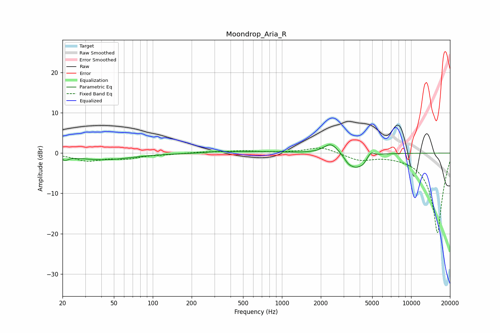

# Moondrop_Aria_R
See [usage instructions](https://github.com/jaakkopasanen/AutoEq#usage) for more options and info.

### Parametric EQs
Apply preamp of -2.2 dB when using parametric equalizer.

|   # | Type    |   Fc (Hz) |    Q |   Gain (dB) |
|-----|---------|-----------|------|-------------|
|   1 | Peaking |        20 | 6    |         0.8 |
|   2 | Peaking |        20 | 5.04 |        -1.7 |
|   3 | Peaking |        42 | 0.66 |        -1.6 |
|   4 | Peaking |       313 | 2.64 |         0.3 |
|   5 | Peaking |       595 | 0.71 |         0.4 |
|   6 | Peaking |      2395 | 2.61 |         2.6 |
|   7 | Peaking |      3251 | 4.81 |        -1.2 |
|   8 | Peaking |      3748 | 2.56 |        -3.4 |
|   9 | Peaking |      4260 | 6    |        -0.9 |
|  10 | Peaking |      4894 | 6    |         1.1 |

### Fixed Band EQs
When using fixed band (also called graphic) equalizer, apply preamp of **-1.4 dB** (if available) and set gains manually with these parameters.

|   # | Type    |   Fc (Hz) |    Q |   Gain (dB) |
|-----|---------|-----------|------|-------------|
|   1 | Peaking |        31 | 1.41 |        -1.8 |
|   2 | Peaking |        62 | 1.41 |        -1.2 |
|   3 | Peaking |       125 | 1.41 |        -0.2 |
|   4 | Peaking |       250 | 1.41 |         0.3 |
|   5 | Peaking |       500 | 1.41 |         0.5 |
|   6 | Peaking |      1000 | 1.41 |         0.1 |
|   7 | Peaking |      2000 | 1.41 |         1.6 |
|   8 | Peaking |      4000 | 1.41 |        -1.7 |
|   9 | Peaking |      8000 | 1.41 |        -0.2 |
|  10 | Peaking |     16000 | 1.41 |       -20   |

### Graphs

