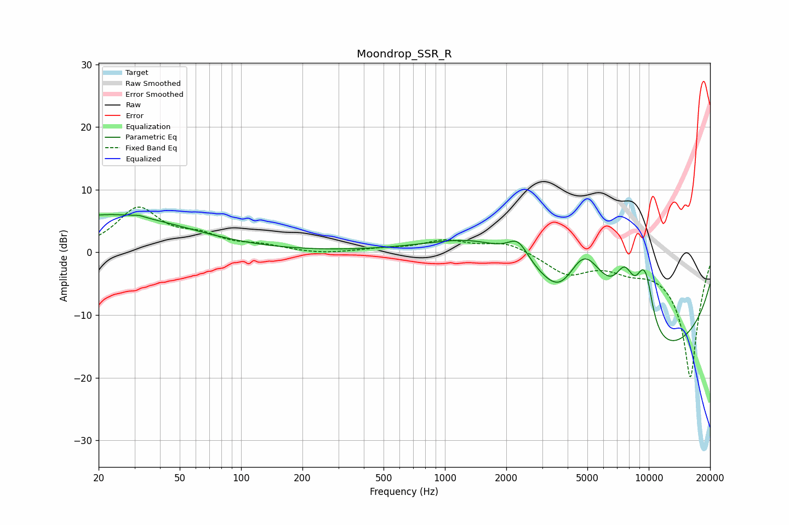

# Moondrop_SSR_R
See [usage instructions](https://github.com/jaakkopasanen/AutoEq#usage) for more options and info.

### Parametric EQs
Apply preamp of -6.1 dB when using parametric equalizer.

|   # | Type    |   Fc (Hz) |    Q |   Gain (dB) |
|-----|---------|-----------|------|-------------|
|   1 | Peaking |        23 | 0.37 |         6   |
|   2 | Peaking |        32 | 5.39 |         0.3 |
|   3 | Peaking |      1510 | 0.53 |         7.1 |
|   4 | Peaking |      2284 | 2.74 |         3.3 |
|   5 | Peaking |      3698 | 1.54 |        -4.9 |
|   6 | Peaking |      4830 | 0.96 |        15.3 |
|   7 | Peaking |      7646 | 2.48 |         7.6 |
|   8 | Peaking |      8550 | 0.22 |       -19.8 |
|   9 | Peaking |      9301 | 3.32 |         5.4 |
|  10 | Peaking |      9817 | 3.69 |         4.9 |

### Fixed Band EQs
When using fixed band (also called graphic) equalizer, apply preamp of **-7.3 dB** (if available) and set gains manually with these parameters.

|   # | Type    |   Fc (Hz) |    Q |   Gain (dB) |
|-----|---------|-----------|------|-------------|
|   1 | Peaking |        31 | 1.41 |         6.8 |
|   2 | Peaking |        62 | 1.41 |         2.1 |
|   3 | Peaking |       125 | 1.41 |         0.9 |
|   4 | Peaking |       250 | 1.41 |        -0.3 |
|   5 | Peaking |       500 | 1.41 |         0.5 |
|   6 | Peaking |      1000 | 1.41 |         1.8 |
|   7 | Peaking |      2000 | 1.41 |         1.6 |
|   8 | Peaking |      4000 | 1.41 |        -3.3 |
|   9 | Peaking |      8000 | 1.41 |        -1.7 |
|  10 | Peaking |     16000 | 1.41 |       -20   |

### Graphs

