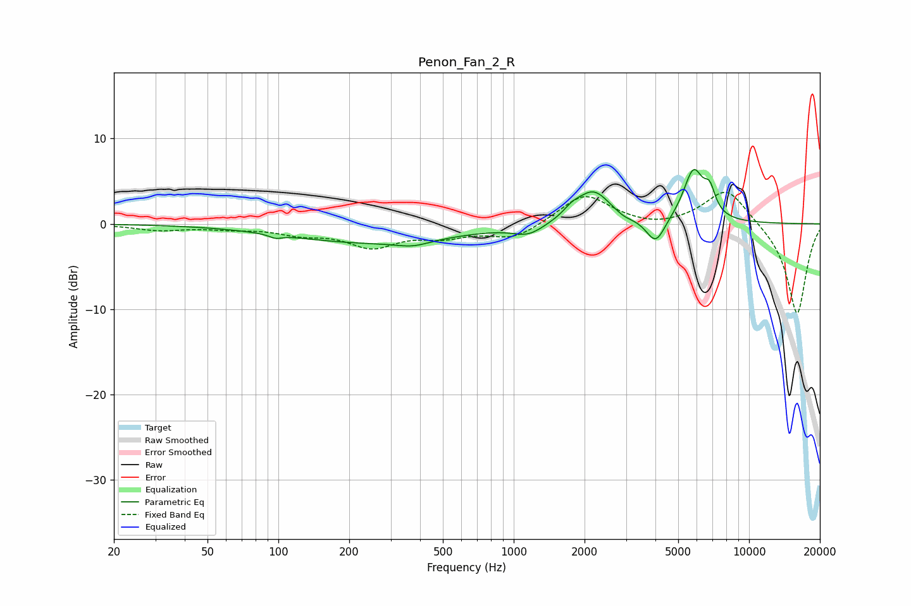

# Penon_Fan_2_R
See [usage instructions](https://github.com/jaakkopasanen/AutoEq#usage) for more options and info.

### Parametric EQs
Apply preamp of -6.5 dB when using parametric equalizer.

|   # | Type    |   Fc (Hz) |    Q |   Gain (dB) |
|-----|---------|-----------|------|-------------|
|   1 | Peaking |        97 | 5.36 |        -0.4 |
|   2 | Peaking |       244 | 0.4  |        -2.2 |
|   3 | Peaking |       374 | 1.97 |        -0.7 |
|   4 | Peaking |      1156 | 2.19 |        -1.2 |
|   5 | Peaking |      1767 | 3.72 |         0.8 |
|   6 | Peaking |      2180 | 1.93 |         3.9 |
|   7 | Peaking |      2938 | 3.96 |        -0.4 |
|   8 | Peaking |      4012 | 3.53 |        -3   |
|   9 | Peaking |      5809 | 3.15 |         6.1 |
|  10 | Peaking |      6810 | 5.86 |         2.5 |

### Fixed Band EQs
When using fixed band (also called graphic) equalizer, apply preamp of **-3.8 dB** (if available) and set gains manually with these parameters.

|   # | Type    |   Fc (Hz) |    Q |   Gain (dB) |
|-----|---------|-----------|------|-------------|
|   1 | Peaking |        31 | 1.41 |        -0.7 |
|   2 | Peaking |        62 | 1.41 |        -0.4 |
|   3 | Peaking |       125 | 1.41 |        -1   |
|   4 | Peaking |       250 | 1.41 |        -2.5 |
|   5 | Peaking |       500 | 1.41 |        -1.3 |
|   6 | Peaking |      1000 | 1.41 |        -1.7 |
|   7 | Peaking |      2000 | 1.41 |         3.6 |
|   8 | Peaking |      4000 | 1.41 |        -0.5 |
|   9 | Peaking |      8000 | 1.41 |         4.3 |
|  10 | Peaking |     16000 | 1.41 |       -10.7 |

### Graphs

