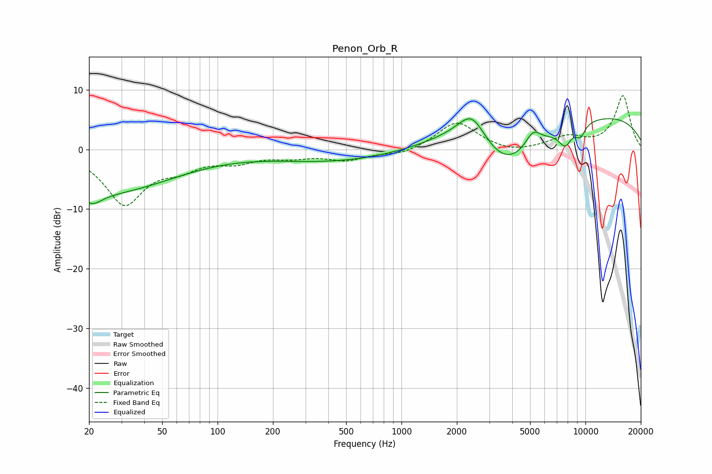

# Penon_Orb_R
See [usage instructions](https://github.com/jaakkopasanen/AutoEq#usage) for more options and info.

### Parametric EQs
Apply preamp of -5.3 dB when using parametric equalizer.

|   # | Type    |   Fc (Hz) |    Q |   Gain (dB) |
|-----|---------|-----------|------|-------------|
|   1 | Peaking |        20 | 2.35 |        -2.6 |
|   2 | Peaking |        27 | 0.4  |        -6.8 |
|   3 | Peaking |       433 | 0.42 |        -2   |
|   4 | Peaking |      2129 | 0.74 |         3.1 |
|   5 | Peaking |      2416 | 1.91 |         4.9 |
|   6 | Peaking |      3717 | 0.75 |        -8.3 |
|   7 | Peaking |      5189 | 3.17 |         2.8 |
|   8 | Peaking |      7758 | 3.72 |        -2.9 |
|   9 | Peaking |      9398 | 4.94 |        -2   |
|  10 | Peaking |      9962 | 0.22 |         6.1 |

### Fixed Band EQs
When using fixed band (also called graphic) equalizer, apply preamp of **-9.1 dB** (if available) and set gains manually with these parameters.

|   # | Type    |   Fc (Hz) |    Q |   Gain (dB) |
|-----|---------|-----------|------|-------------|
|   1 | Peaking |        31 | 1.41 |        -8.9 |
|   2 | Peaking |        62 | 1.41 |        -2.4 |
|   3 | Peaking |       125 | 1.41 |        -1.7 |
|   4 | Peaking |       250 | 1.41 |        -1   |
|   5 | Peaking |       500 | 1.41 |        -1.6 |
|   6 | Peaking |      1000 | 1.41 |        -0.9 |
|   7 | Peaking |      2000 | 1.41 |         4.7 |
|   8 | Peaking |      4000 | 1.41 |        -0.8 |
|   9 | Peaking |      8000 | 1.41 |         1.9 |
|  10 | Peaking |     16000 | 1.41 |         9   |

### Graphs

