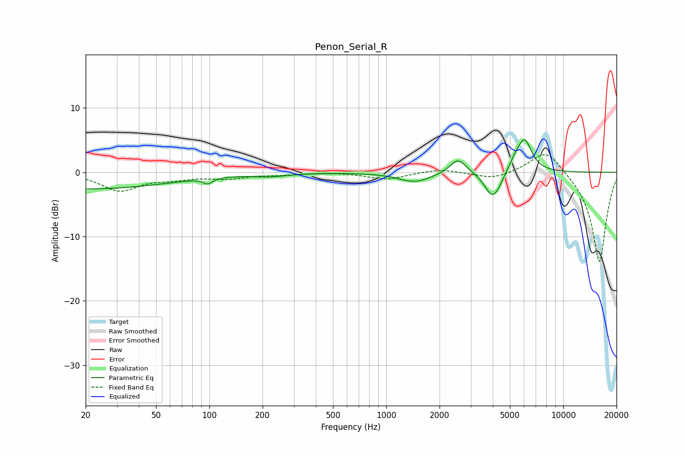

# Penon_Serial_R
See [usage instructions](https://github.com/jaakkopasanen/AutoEq#usage) for more options and info.

### Parametric EQs
Apply preamp of -5.2 dB when using parametric equalizer.

|   # | Type    |   Fc (Hz) |    Q |   Gain (dB) |
|-----|---------|-----------|------|-------------|
|   1 | Peaking |        20 | 0.29 |        -2.6 |
|   2 | Peaking |        97 | 6    |         0.8 |
|   3 | Peaking |        98 | 5.81 |        -1.7 |
|   4 | Peaking |       221 | 1.47 |        -0.5 |
|   5 | Peaking |      1450 | 1.53 |        -1.5 |
|   6 | Peaking |      2549 | 3.06 |         2.4 |
|   7 | Peaking |      3970 | 3.21 |        -3.9 |
|   8 | Peaking |      4329 | 5.42 |        -0.5 |
|   9 | Peaking |      5334 | 4.31 |         1.2 |
|  10 | Peaking |      6048 | 3.35 |         5   |

### Fixed Band EQs
When using fixed band (also called graphic) equalizer, apply preamp of **-2.8 dB** (if available) and set gains manually with these parameters.

|   # | Type    |   Fc (Hz) |    Q |   Gain (dB) |
|-----|---------|-----------|------|-------------|
|   1 | Peaking |        31 | 1.41 |        -2.8 |
|   2 | Peaking |        62 | 1.41 |        -0.8 |
|   3 | Peaking |       125 | 1.41 |        -0.8 |
|   4 | Peaking |       250 | 1.41 |        -0.3 |
|   5 | Peaking |       500 | 1.41 |         0.1 |
|   6 | Peaking |      1000 | 1.41 |        -1.1 |
|   7 | Peaking |      2000 | 1.41 |         0.6 |
|   8 | Peaking |      4000 | 1.41 |        -1.1 |
|   9 | Peaking |      8000 | 1.41 |         3.8 |
|  10 | Peaking |     16000 | 1.41 |       -14.1 |

### Graphs

