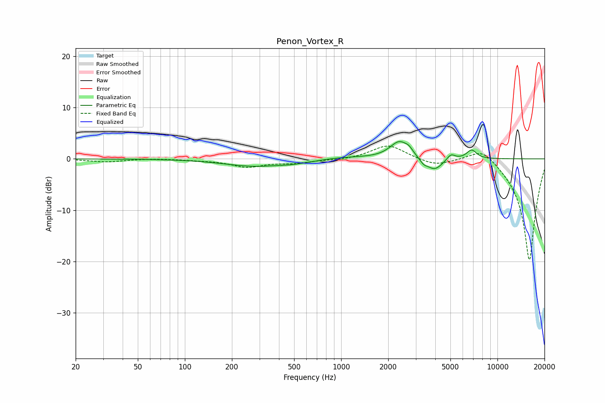

# Penon_Vortex_R
See [usage instructions](https://github.com/jaakkopasanen/AutoEq#usage) for more options and info.

### Parametric EQs
Apply preamp of -3.5 dB when using parametric equalizer.

|   # | Type    |   Fc (Hz) |    Q |   Gain (dB) |
|-----|---------|-----------|------|-------------|
|   1 | Peaking |       278 | 0.73 |        -1.4 |
|   2 | Peaking |       482 | 1.73 |        -0.3 |
|   3 | Peaking |       620 | 1.43 |        -0.2 |
|   4 | Peaking |      1060 | 0.9  |         0.4 |
|   5 | Peaking |      2359 | 2.35 |         3.4 |
|   6 | Peaking |      2719 | 6    |         0.7 |
|   7 | Peaking |      3367 | 6    |        -0.8 |
|   8 | Peaking |      3954 | 2.69 |        -2.4 |
|   9 | Peaking |      5038 | 5.26 |         1.2 |
|  10 | Peaking |      6833 | 4.28 |         1.8 |

### Fixed Band EQs
When using fixed band (also called graphic) equalizer, apply preamp of **-2.6 dB** (if available) and set gains manually with these parameters.

|   # | Type    |   Fc (Hz) |    Q |   Gain (dB) |
|-----|---------|-----------|------|-------------|
|   1 | Peaking |        31 | 1.41 |        -0.6 |
|   2 | Peaking |        62 | 1.41 |         0.1 |
|   3 | Peaking |       125 | 1.41 |        -0.2 |
|   4 | Peaking |       250 | 1.41 |        -1.5 |
|   5 | Peaking |       500 | 1.41 |        -0.7 |
|   6 | Peaking |      1000 | 1.41 |        -0.3 |
|   7 | Peaking |      2000 | 1.41 |         2.8 |
|   8 | Peaking |      4000 | 1.41 |        -1.3 |
|   9 | Peaking |      8000 | 1.41 |         2.8 |
|  10 | Peaking |     16000 | 1.41 |       -20   |

### Graphs

