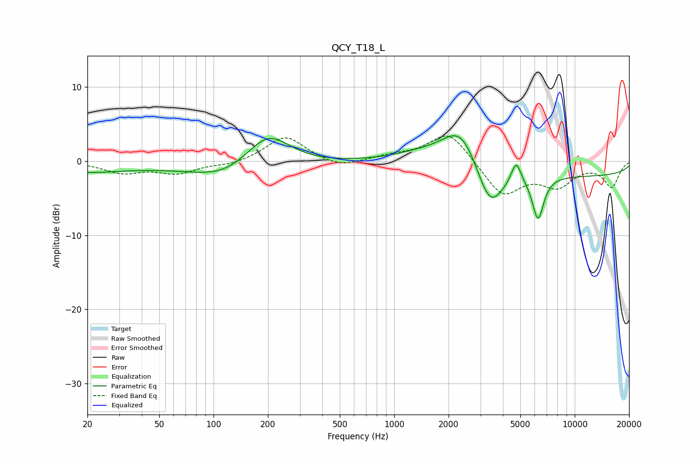

# QCY_T18_L
See [usage instructions](https://github.com/jaakkopasanen/AutoEq#usage) for more options and info.

### Parametric EQs
Apply preamp of -3.5 dB when using parametric equalizer.

|   # | Type    |   Fc (Hz) |    Q |   Gain (dB) |
|-----|---------|-----------|------|-------------|
|   1 | Peaking |        20 | 1    |        -0.8 |
|   2 | Peaking |        73 | 0.18 |        -1   |
|   3 | Peaking |       113 | 0.9  |        -1.6 |
|   4 | Peaking |       200 | 1.16 |         4.5 |
|   5 | Peaking |      1427 | 0.86 |         1.1 |
|   6 | Peaking |      2347 | 1.37 |         5.5 |
|   7 | Peaking |      3388 | 1.87 |        -6.2 |
|   8 | Peaking |      4738 | 5.21 |         3   |
|   9 | Peaking |      6261 | 4.34 |        -5.8 |
|  10 | Peaking |     10000 | 0.18 |        -2   |

### Fixed Band EQs
When using fixed band (also called graphic) equalizer, apply preamp of **-3.5 dB** (if available) and set gains manually with these parameters.

|   # | Type    |   Fc (Hz) |    Q |   Gain (dB) |
|-----|---------|-----------|------|-------------|
|   1 | Peaking |        31 | 1.41 |        -1.5 |
|   2 | Peaking |        62 | 1.41 |        -1.5 |
|   3 | Peaking |       125 | 1.41 |        -0.5 |
|   4 | Peaking |       250 | 1.41 |         3.4 |
|   5 | Peaking |       500 | 1.41 |        -1   |
|   6 | Peaking |      1000 | 1.41 |         0.6 |
|   7 | Peaking |      2000 | 1.41 |         4.1 |
|   8 | Peaking |      4000 | 1.41 |        -4.6 |
|   9 | Peaking |      8000 | 1.41 |        -3   |
|  10 | Peaking |     16000 | 1.41 |        -3.4 |

### Graphs

