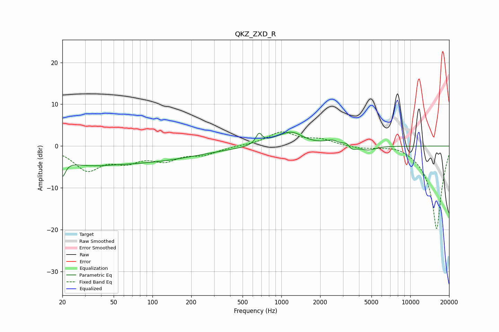

# QKZ_ZXD_R
See [usage instructions](https://github.com/jaakkopasanen/AutoEq#usage) for more options and info.

### Parametric EQs
Apply preamp of -3.4 dB when using parametric equalizer.

|   # | Type    |   Fc (Hz) |    Q |   Gain (dB) |
|-----|---------|-----------|------|-------------|
|   1 | Peaking |        20 | 5.88 |        -4   |
|   2 | Peaking |        29 | 0.83 |        -1.4 |
|   3 | Peaking |        67 | 0.27 |        -3.9 |
|   4 | Peaking |       670 | 6    |         2.5 |
|   5 | Peaking |       865 | 1.91 |         0.6 |
|   6 | Peaking |      1192 | 1.52 |         3.2 |
|   7 | Peaking |      2478 | 2.72 |         1.1 |
|   8 | Peaking |      3242 | 4.91 |         1.6 |
|   9 | Peaking |      3432 | 3.71 |        -1.8 |
|  10 | Peaking |      4748 | 2.52 |        -1   |

### Fixed Band EQs
When using fixed band (also called graphic) equalizer, apply preamp of **-3.5 dB** (if available) and set gains manually with these parameters.

|   # | Type    |   Fc (Hz) |    Q |   Gain (dB) |
|-----|---------|-----------|------|-------------|
|   1 | Peaking |        31 | 1.41 |        -5.4 |
|   2 | Peaking |        62 | 1.41 |        -3   |
|   3 | Peaking |       125 | 1.41 |        -2.9 |
|   4 | Peaking |       250 | 1.41 |        -1.8 |
|   5 | Peaking |       500 | 1.41 |         0.1 |
|   6 | Peaking |      1000 | 1.41 |         3.2 |
|   7 | Peaking |      2000 | 1.41 |         1.4 |
|   8 | Peaking |      4000 | 1.41 |        -0.5 |
|   9 | Peaking |      8000 | 1.41 |         0.8 |
|  10 | Peaking |     16000 | 1.41 |       -20   |

### Graphs

