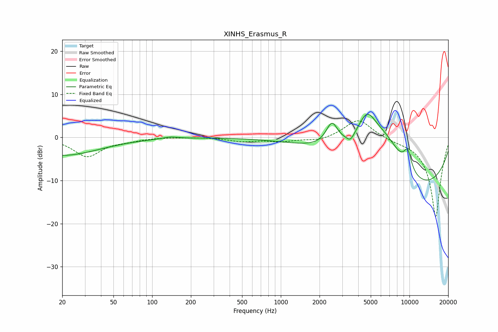

# XINHS_Erasmus_R
See [usage instructions](https://github.com/jaakkopasanen/AutoEq#usage) for more options and info.

### Parametric EQs
Apply preamp of -5.5 dB when using parametric equalizer.

|   # | Type    |   Fc (Hz) |    Q |   Gain (dB) |
|-----|---------|-----------|------|-------------|
|   1 | Peaking |        20 | 0.49 |        -4.2 |
|   2 | Peaking |       138 | 2.5  |         0.5 |
|   3 | Peaking |      2496 | 3.04 |         5.3 |
|   4 | Peaking |      3481 | 4.91 |        -1.5 |
|   5 | Peaking |      4665 | 1.91 |         6.8 |
|   6 | Peaking |      6438 | 0.65 |        12.5 |
|   7 | Peaking |      8927 | 5.88 |         0   |
|   8 | Peaking |      9650 | 0.2  |       -10.6 |
|   9 | Peaking |      9686 | 4.11 |         4.5 |
|  10 | Peaking |      9807 | 0.5  |        -5.2 |

### Fixed Band EQs
When using fixed band (also called graphic) equalizer, apply preamp of **-3.9 dB** (if available) and set gains manually with these parameters.

|   # | Type    |   Fc (Hz) |    Q |   Gain (dB) |
|-----|---------|-----------|------|-------------|
|   1 | Peaking |        31 | 1.41 |        -4.4 |
|   2 | Peaking |        62 | 1.41 |        -0.6 |
|   3 | Peaking |       125 | 1.41 |         0.1 |
|   4 | Peaking |       250 | 1.41 |         0.1 |
|   5 | Peaking |       500 | 1.41 |        -0.9 |
|   6 | Peaking |      1000 | 1.41 |        -0.9 |
|   7 | Peaking |      2000 | 1.41 |        -0.8 |
|   8 | Peaking |      4000 | 1.41 |         4.4 |
|   9 | Peaking |      8000 | 1.41 |        -0.5 |
|  10 | Peaking |     16000 | 1.41 |       -18.5 |

### Graphs

