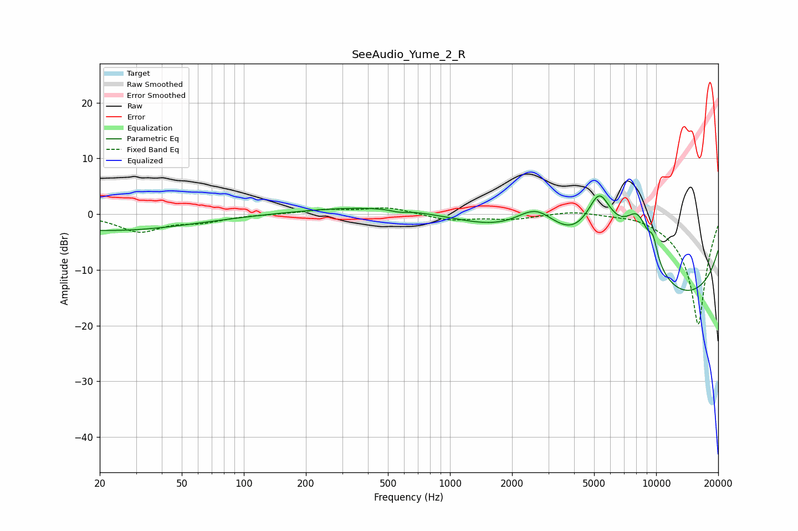

# SeeAudio_Yume_2_R
See [usage instructions](https://github.com/jaakkopasanen/AutoEq#usage) for more options and info.

### Parametric EQs
Apply preamp of -3.4 dB when using parametric equalizer.

|   # | Type    |   Fc (Hz) |    Q |   Gain (dB) |
|-----|---------|-----------|------|-------------|
|   1 | Peaking |        22 | 0.36 |        -3   |
|   2 | Peaking |       564 | 3.8  |        -0.4 |
|   3 | Peaking |       818 | 0.27 |         2.3 |
|   4 | Peaking |      2620 | 1.31 |         6.1 |
|   5 | Peaking |      3872 | 3.18 |        -0.1 |
|   6 | Peaking |      5292 | 2.25 |         8.7 |
|   7 | Peaking |      7166 | 0.62 |         9.8 |
|   8 | Peaking |      8191 | 2.09 |         7.5 |
|   9 | Peaking |      9658 | 5.85 |         3.2 |
|  10 | Peaking |      9927 | 0.21 |       -19.9 |

### Fixed Band EQs
When using fixed band (also called graphic) equalizer, apply preamp of **-1.2 dB** (if available) and set gains manually with these parameters.

|   # | Type    |   Fc (Hz) |    Q |   Gain (dB) |
|-----|---------|-----------|------|-------------|
|   1 | Peaking |        31 | 1.41 |        -3   |
|   2 | Peaking |        62 | 1.41 |        -1.2 |
|   3 | Peaking |       125 | 1.41 |        -0   |
|   4 | Peaking |       250 | 1.41 |         0.8 |
|   5 | Peaking |       500 | 1.41 |         1.2 |
|   6 | Peaking |      1000 | 1.41 |        -1.1 |
|   7 | Peaking |      2000 | 1.41 |        -0.8 |
|   8 | Peaking |      4000 | 1.41 |         0.7 |
|   9 | Peaking |      8000 | 1.41 |         0.5 |
|  10 | Peaking |     16000 | 1.41 |       -20   |

### Graphs

