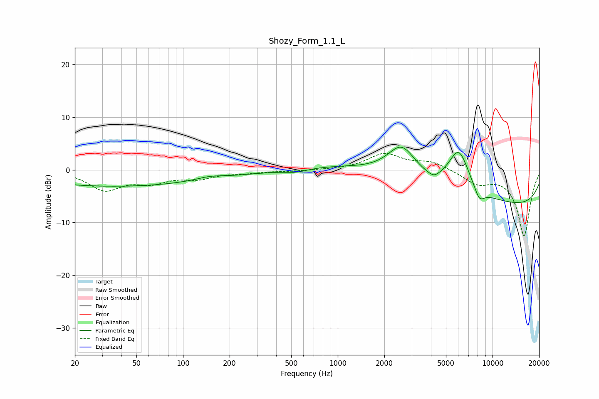

# Shozy_Form_1.1_L
See [usage instructions](https://github.com/jaakkopasanen/AutoEq#usage) for more options and info.

### Parametric EQs
Apply preamp of -4.4 dB when using parametric equalizer.

|   # | Type    |   Fc (Hz) |    Q |   Gain (dB) |
|-----|---------|-----------|------|-------------|
|   1 | Peaking |        32 | 0.23 |        -2.3 |
|   2 | Peaking |        64 | 0.18 |        -0.9 |
|   3 | Peaking |       149 | 1.68 |         0.6 |
|   4 | Peaking |       534 | 1.8  |        -0.6 |
|   5 | Peaking |      2586 | 1.51 |         6.2 |
|   6 | Peaking |      3879 | 0.18 |         2.9 |
|   7 | Peaking |      4176 | 3.8  |        -1   |
|   8 | Peaking |      6050 | 1.93 |         8.2 |
|   9 | Peaking |      8218 | 3.84 |        -2.5 |
|  10 | Peaking |      9720 | 0.18 |        -8.5 |

### Fixed Band EQs
When using fixed band (also called graphic) equalizer, apply preamp of **-3.2 dB** (if available) and set gains manually with these parameters.

|   # | Type    |   Fc (Hz) |    Q |   Gain (dB) |
|-----|---------|-----------|------|-------------|
|   1 | Peaking |        31 | 1.41 |        -3.6 |
|   2 | Peaking |        62 | 1.41 |        -2   |
|   3 | Peaking |       125 | 1.41 |        -1.4 |
|   4 | Peaking |       250 | 1.41 |        -0.5 |
|   5 | Peaking |       500 | 1.41 |        -0.2 |
|   6 | Peaking |      1000 | 1.41 |        -0   |
|   7 | Peaking |      2000 | 1.41 |         3   |
|   8 | Peaking |      4000 | 1.41 |         1.5 |
|   9 | Peaking |      8000 | 1.41 |        -2.4 |
|  10 | Peaking |     16000 | 1.41 |       -12.5 |

### Graphs

