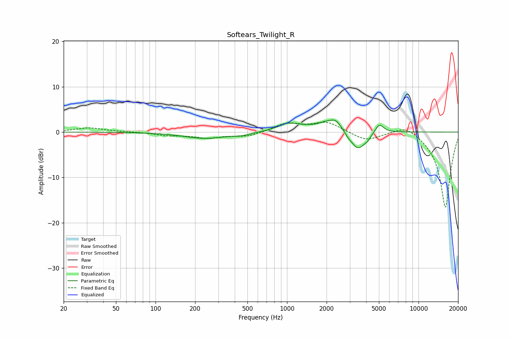

# Softears_Twilight_R
See [usage instructions](https://github.com/jaakkopasanen/AutoEq#usage) for more options and info.

### Parametric EQs
Apply preamp of -2.8 dB when using parametric equalizer.

|   # | Type    |   Fc (Hz) |    Q |   Gain (dB) |
|-----|---------|-----------|------|-------------|
|   1 | Peaking |       236 | 0.88 |        -1.4 |
|   2 | Peaking |       451 | 2.11 |        -0.5 |
|   3 | Peaking |      1012 | 1.92 |         1.5 |
|   4 | Peaking |      1652 | 3.23 |        -0.4 |
|   5 | Peaking |      2132 | 1.04 |         2.8 |
|   6 | Peaking |      2339 | 4.39 |         0.9 |
|   7 | Peaking |      2899 | 5.06 |        -0.7 |
|   8 | Peaking |      3454 | 2.36 |        -4.7 |
|   9 | Peaking |      4095 | 6    |        -0.6 |
|  10 | Peaking |      5038 | 4.39 |         2   |

### Fixed Band EQs
When using fixed band (also called graphic) equalizer, apply preamp of **-2.3 dB** (if available) and set gains manually with these parameters.

|   # | Type    |   Fc (Hz) |    Q |   Gain (dB) |
|-----|---------|-----------|------|-------------|
|   1 | Peaking |        31 | 1.41 |         0.9 |
|   2 | Peaking |        62 | 1.41 |         0.1 |
|   3 | Peaking |       125 | 1.41 |        -0.7 |
|   4 | Peaking |       250 | 1.41 |        -1.2 |
|   5 | Peaking |       500 | 1.41 |        -1   |
|   6 | Peaking |      1000 | 1.41 |         1.9 |
|   7 | Peaking |      2000 | 1.41 |         2.2 |
|   8 | Peaking |      4000 | 1.41 |        -1.9 |
|   9 | Peaking |      8000 | 1.41 |         1.9 |
|  10 | Peaking |     16000 | 1.41 |       -16.8 |

### Graphs

