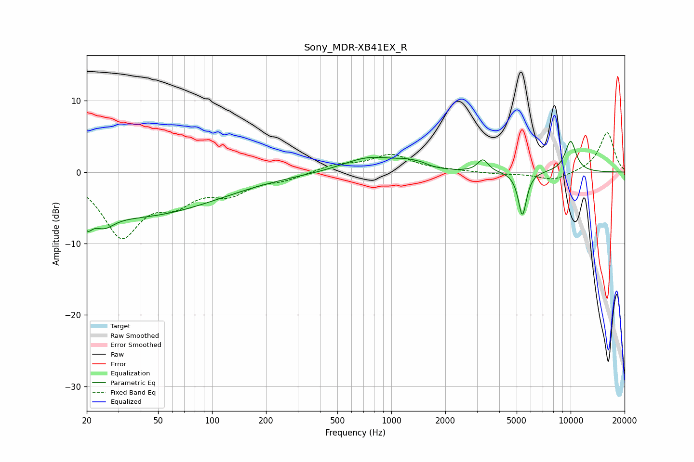

# Sony_MDR-XB41EX_R
See [usage instructions](https://github.com/jaakkopasanen/AutoEq#usage) for more options and info.

### Parametric EQs
Apply preamp of -4.4 dB when using parametric equalizer.

|   # | Type    |   Fc (Hz) |    Q |   Gain (dB) |
|-----|---------|-----------|------|-------------|
|   1 | Peaking |        20 | 5.23 |        -2.2 |
|   2 | Peaking |        25 | 2.53 |        -1.9 |
|   3 | Peaking |        37 | 0.3  |        -6.1 |
|   4 | Peaking |       756 | 0.88 |         2.6 |
|   5 | Peaking |       791 | 0.48 |        -0.6 |
|   6 | Peaking |      1240 | 1.94 |         0.9 |
|   7 | Peaking |      1474 | 3.78 |         0.3 |
|   8 | Peaking |      3240 | 4.79 |         1.7 |
|   9 | Peaking |      5382 | 6    |        -6.2 |
|  10 | Peaking |     10000 | 3.85 |         4.4 |

### Fixed Band EQs
When using fixed band (also called graphic) equalizer, apply preamp of **-5.6 dB** (if available) and set gains manually with these parameters.

|   # | Type    |   Fc (Hz) |    Q |   Gain (dB) |
|-----|---------|-----------|------|-------------|
|   1 | Peaking |        31 | 1.41 |        -8.6 |
|   2 | Peaking |        62 | 1.41 |        -3.3 |
|   3 | Peaking |       125 | 1.41 |        -2.6 |
|   4 | Peaking |       250 | 1.41 |        -0.9 |
|   5 | Peaking |       500 | 1.41 |         1   |
|   6 | Peaking |      1000 | 1.41 |         2.3 |
|   7 | Peaking |      2000 | 1.41 |         0.2 |
|   8 | Peaking |      4000 | 1.41 |        -0.3 |
|   9 | Peaking |      8000 | 1.41 |        -1.2 |
|  10 | Peaking |     16000 | 1.41 |         5.6 |

### Graphs

