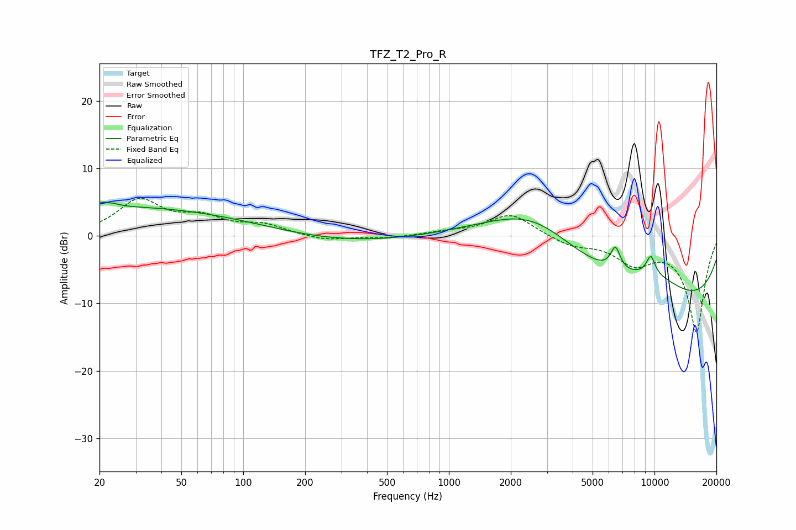

# TFZ_T2_Pro_R
See [usage instructions](https://github.com/jaakkopasanen/AutoEq#usage) for more options and info.

### Parametric EQs
Apply preamp of -5.1 dB when using parametric equalizer.

|   # | Type    |   Fc (Hz) |    Q |   Gain (dB) |
|-----|---------|-----------|------|-------------|
|   1 | Peaking |        22 | 4.7  |         3.2 |
|   2 | Peaking |        22 | 5.71 |        -2.4 |
|   3 | Peaking |        33 | 0.22 |         4.5 |
|   4 | Peaking |       113 | 0.35 |        -0.7 |
|   5 | Peaking |       358 | 0.36 |        -1.1 |
|   6 | Peaking |      2607 | 0.51 |         9.3 |
|   7 | Peaking |      6459 | 5.73 |         3.4 |
|   8 | Peaking |      9328 | 0.2  |       -13.3 |
|   9 | Peaking |      9592 | 5.65 |         2.8 |
|  10 | Peaking |     10000 | 0.65 |         5.5 |

### Fixed Band EQs
When using fixed band (also called graphic) equalizer, apply preamp of **-5.6 dB** (if available) and set gains manually with these parameters.

|   # | Type    |   Fc (Hz) |    Q |   Gain (dB) |
|-----|---------|-----------|------|-------------|
|   1 | Peaking |        31 | 1.41 |         5.1 |
|   2 | Peaking |        62 | 1.41 |         2.3 |
|   3 | Peaking |       125 | 1.41 |         1.5 |
|   4 | Peaking |       250 | 1.41 |        -0.8 |
|   5 | Peaking |       500 | 1.41 |        -0.4 |
|   6 | Peaking |      1000 | 1.41 |         0.5 |
|   7 | Peaking |      2000 | 1.41 |         3.3 |
|   8 | Peaking |      4000 | 1.41 |        -1.4 |
|   9 | Peaking |      8000 | 1.41 |        -3.6 |
|  10 | Peaking |     16000 | 1.41 |       -14.2 |

### Graphs

