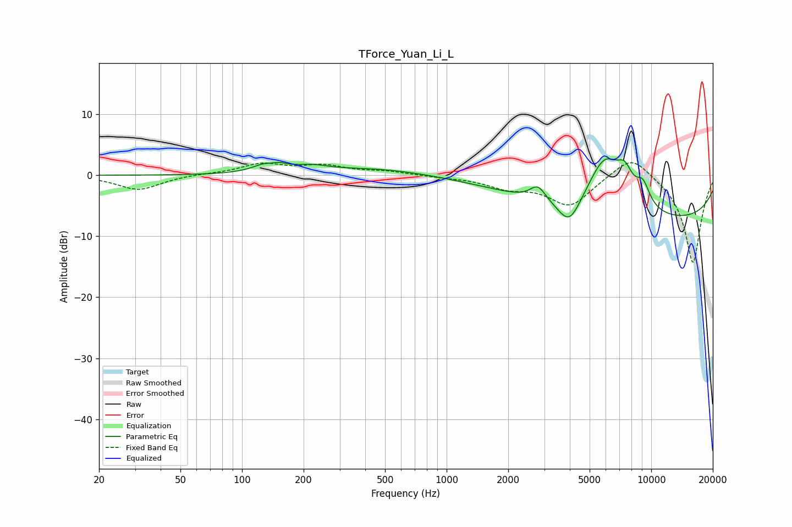

# TForce_Yuan_Li_L
See [usage instructions](https://github.com/jaakkopasanen/AutoEq#usage) for more options and info.

### Parametric EQs
Apply preamp of -2.8 dB when using parametric equalizer.

|   # | Type    |   Fc (Hz) |    Q |   Gain (dB) |
|-----|---------|-----------|------|-------------|
|   1 | Peaking |       138 | 4.64 |        -0.7 |
|   2 | Peaking |       138 | 2.27 |         2.2 |
|   3 | Peaking |       219 | 1.81 |         0.8 |
|   4 | Peaking |       450 | 0.52 |         1.2 |
|   5 | Peaking |      2794 | 3.73 |         2.4 |
|   6 | Peaking |      3986 | 2.46 |        -4.7 |
|   7 | Peaking |      5937 | 1.49 |         9.4 |
|   8 | Peaking |      7433 | 3.5  |         3.5 |
|   9 | Peaking |      9103 | 3.55 |         3.6 |
|  10 | Peaking |     10000 | 0.19 |        -7.6 |

### Fixed Band EQs
When using fixed band (also called graphic) equalizer, apply preamp of **-2.2 dB** (if available) and set gains manually with these parameters.

|   # | Type    |   Fc (Hz) |    Q |   Gain (dB) |
|-----|---------|-----------|------|-------------|
|   1 | Peaking |        31 | 1.41 |        -2.4 |
|   2 | Peaking |        62 | 1.41 |         0.2 |
|   3 | Peaking |       125 | 1.41 |         1.8 |
|   4 | Peaking |       250 | 1.41 |         1.4 |
|   5 | Peaking |       500 | 1.41 |         0.6 |
|   6 | Peaking |      1000 | 1.41 |        -0.2 |
|   7 | Peaking |      2000 | 1.41 |        -1.8 |
|   8 | Peaking |      4000 | 1.41 |        -4.9 |
|   9 | Peaking |      8000 | 1.41 |         3.9 |
|  10 | Peaking |     16000 | 1.41 |       -14.5 |

### Graphs

