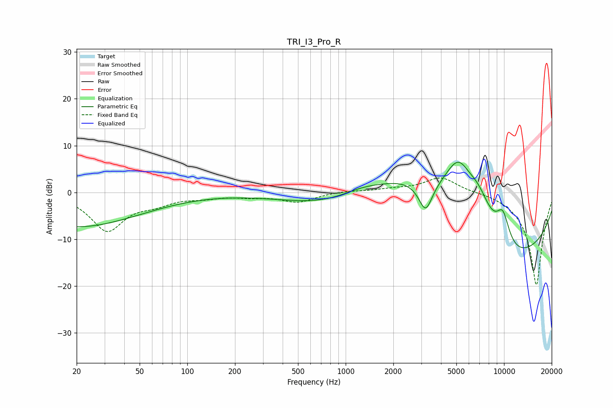

# TRI_I3_Pro_R
See [usage instructions](https://github.com/jaakkopasanen/AutoEq#usage) for more options and info.

### Parametric EQs
Apply preamp of -6.5 dB when using parametric equalizer.

|   # | Type    |   Fc (Hz) |    Q |   Gain (dB) |
|-----|---------|-----------|------|-------------|
|   1 | Peaking |        20 | 0.35 |        -7.3 |
|   2 | Peaking |      1289 | 0.81 |         3.6 |
|   3 | Peaking |      2391 | 0.62 |         8   |
|   4 | Peaking |      3197 | 3.25 |        -6.3 |
|   5 | Peaking |      4891 | 0.59 |        14.6 |
|   6 | Peaking |      5164 | 1.95 |         5.5 |
|   7 | Peaking |      6409 | 0.18 |       -20   |
|   8 | Peaking |      6918 | 1.52 |         6.8 |
|   9 | Peaking |      9823 | 2.74 |         7.1 |
|  10 | Peaking |     10000 | 0.81 |        -3   |

### Fixed Band EQs
When using fixed band (also called graphic) equalizer, apply preamp of **-3.2 dB** (if available) and set gains manually with these parameters.

|   # | Type    |   Fc (Hz) |    Q |   Gain (dB) |
|-----|---------|-----------|------|-------------|
|   1 | Peaking |        31 | 1.41 |        -8   |
|   2 | Peaking |        62 | 1.41 |        -1.8 |
|   3 | Peaking |       125 | 1.41 |        -0.9 |
|   4 | Peaking |       250 | 1.41 |        -0.7 |
|   5 | Peaking |       500 | 1.41 |        -2   |
|   6 | Peaking |      1000 | 1.41 |         0.3 |
|   7 | Peaking |      2000 | 1.41 |         0.6 |
|   8 | Peaking |      4000 | 1.41 |         3.3 |
|   9 | Peaking |      8000 | 1.41 |         0.3 |
|  10 | Peaking |     16000 | 1.41 |       -20   |

### Graphs

