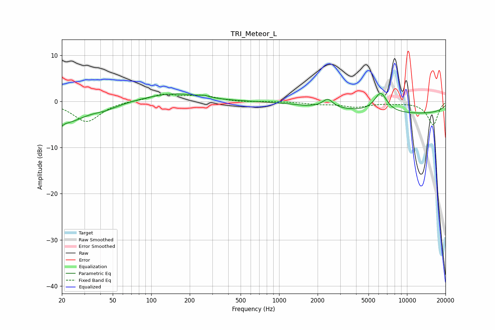

# TRI_Meteor_L
See [usage instructions](https://github.com/jaakkopasanen/AutoEq#usage) for more options and info.

### Parametric EQs
Apply preamp of -1.8 dB when using parametric equalizer.

|   # | Type    |   Fc (Hz) |    Q |   Gain (dB) |
|-----|---------|-----------|------|-------------|
|   1 | Peaking |        20 | 5.44 |        -3.8 |
|   2 | Peaking |        20 | 5.95 |         2.5 |
|   3 | Peaking |        22 | 1.03 |        -4   |
|   4 | Peaking |        44 | 1.32 |        -1.1 |
|   5 | Peaking |       147 | 0.69 |         1.8 |
|   6 | Peaking |       260 | 4.02 |         0.4 |
|   7 | Peaking |      1586 | 2.58 |        -0.1 |
|   8 | Peaking |      2403 | 3.62 |         1.9 |
|   9 | Peaking |      6225 | 2.77 |         4.2 |
|  10 | Peaking |      9970 | 0.18 |        -2.7 |

### Fixed Band EQs
When using fixed band (also called graphic) equalizer, apply preamp of **-1.7 dB** (if available) and set gains manually with these parameters.

|   # | Type    |   Fc (Hz) |    Q |   Gain (dB) |
|-----|---------|-----------|------|-------------|
|   1 | Peaking |        31 | 1.41 |        -4.4 |
|   2 | Peaking |        62 | 1.41 |         0.2 |
|   3 | Peaking |       125 | 1.41 |         1.5 |
|   4 | Peaking |       250 | 1.41 |         1.2 |
|   5 | Peaking |       500 | 1.41 |        -0.2 |
|   6 | Peaking |      1000 | 1.41 |         0   |
|   7 | Peaking |      2000 | 1.41 |        -0.5 |
|   8 | Peaking |      4000 | 1.41 |        -1.1 |
|   9 | Peaking |      8000 | 1.41 |        -0.2 |
|  10 | Peaking |     16000 | 1.41 |        -5   |

### Graphs

