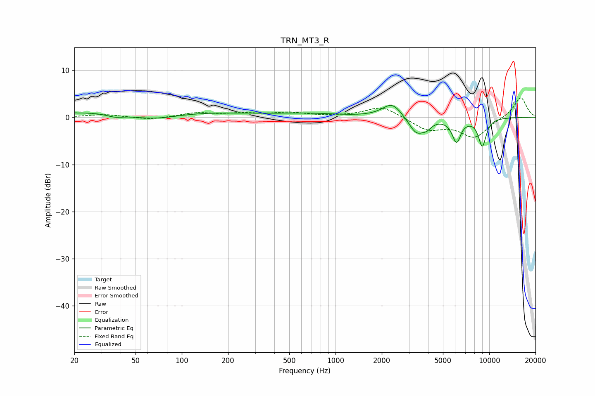

# TRN_MT3_R
See [usage instructions](https://github.com/jaakkopasanen/AutoEq#usage) for more options and info.

### Parametric EQs
Apply preamp of -2.6 dB when using parametric equalizer.

|   # | Type    |   Fc (Hz) |    Q |   Gain (dB) |
|-----|---------|-----------|------|-------------|
|   1 | Peaking |        37 | 2.65 |        -0.7 |
|   2 | Peaking |        56 | 0.2  |         1.5 |
|   3 | Peaking |        65 | 0.88 |        -1.6 |
|   4 | Peaking |       671 | 0.69 |         0.7 |
|   5 | Peaking |      2334 | 2.24 |         3.1 |
|   6 | Peaking |      3354 | 2.83 |        -3.5 |
|   7 | Peaking |      3918 | 4.39 |        -1.3 |
|   8 | Peaking |      6150 | 4.54 |        -5.2 |
|   9 | Peaking |      6551 | 5.99 |         0.4 |
|  10 | Peaking |      9016 | 4.91 |        -5.9 |

### Fixed Band EQs
When using fixed band (also called graphic) equalizer, apply preamp of **-4.2 dB** (if available) and set gains manually with these parameters.

|   # | Type    |   Fc (Hz) |    Q |   Gain (dB) |
|-----|---------|-----------|------|-------------|
|   1 | Peaking |        31 | 1.41 |         0.6 |
|   2 | Peaking |        62 | 1.41 |        -0.5 |
|   3 | Peaking |       125 | 1.41 |         0.9 |
|   4 | Peaking |       250 | 1.41 |         0.7 |
|   5 | Peaking |       500 | 1.41 |         0.9 |
|   6 | Peaking |      1000 | 1.41 |         0.1 |
|   7 | Peaking |      2000 | 1.41 |         2.4 |
|   8 | Peaking |      4000 | 1.41 |        -2.6 |
|   9 | Peaking |      8000 | 1.41 |        -4.1 |
|  10 | Peaking |     16000 | 1.41 |         4.4 |

### Graphs

