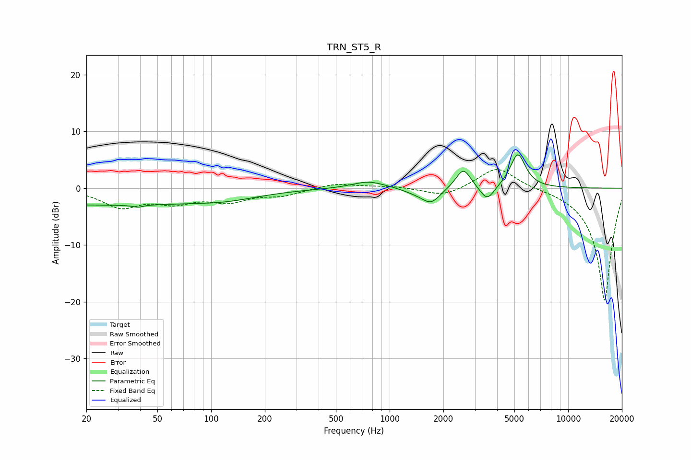

# TRN_ST5_R
See [usage instructions](https://github.com/jaakkopasanen/AutoEq#usage) for more options and info.

### Parametric EQs
Apply preamp of -6.0 dB when using parametric equalizer.

|   # | Type    |   Fc (Hz) |    Q |   Gain (dB) |
|-----|---------|-----------|------|-------------|
|   1 | Peaking |        23 | 0.18 |        -2.9 |
|   2 | Peaking |        38 | 5.98 |         2.6 |
|   3 | Peaking |        38 | 5.75 |        -3   |
|   4 | Peaking |       125 | 0.8  |        -0.9 |
|   5 | Peaking |       764 | 1.51 |         1.3 |
|   6 | Peaking |      1405 | 1.91 |        -0.7 |
|   7 | Peaking |      1708 | 2.79 |        -2.4 |
|   8 | Peaking |      2587 | 3.4  |         3.6 |
|   9 | Peaking |      3520 | 3.53 |        -2.7 |
|  10 | Peaking |      5222 | 3.24 |         6.1 |

### Fixed Band EQs
When using fixed band (also called graphic) equalizer, apply preamp of **-3.4 dB** (if available) and set gains manually with these parameters.

|   # | Type    |   Fc (Hz) |    Q |   Gain (dB) |
|-----|---------|-----------|------|-------------|
|   1 | Peaking |        31 | 1.41 |        -3.1 |
|   2 | Peaking |        62 | 1.41 |        -2.2 |
|   3 | Peaking |       125 | 1.41 |        -2.1 |
|   4 | Peaking |       250 | 1.41 |        -1.2 |
|   5 | Peaking |       500 | 1.41 |         0.9 |
|   6 | Peaking |      1000 | 1.41 |         0.4 |
|   7 | Peaking |      2000 | 1.41 |        -1.6 |
|   8 | Peaking |      4000 | 1.41 |         3.9 |
|   9 | Peaking |      8000 | 1.41 |         0.1 |
|  10 | Peaking |     16000 | 1.41 |       -20   |

### Graphs

