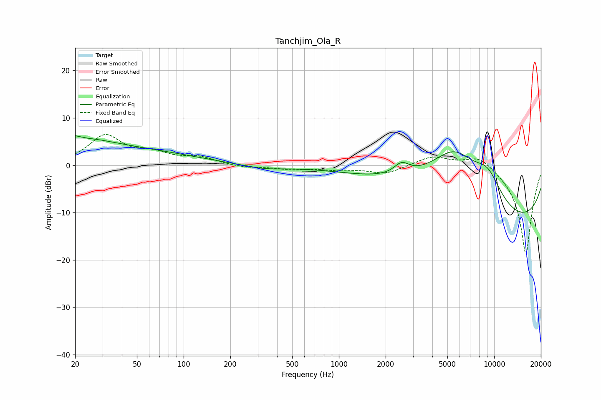

# Tanchjim_Ola_R
See [usage instructions](https://github.com/jaakkopasanen/AutoEq#usage) for more options and info.

### Parametric EQs
Apply preamp of -6.3 dB when using parametric equalizer.

|   # | Type    |   Fc (Hz) |    Q |   Gain (dB) |
|-----|---------|-----------|------|-------------|
|   1 | Peaking |        20 | 4.9  |         2.9 |
|   2 | Peaking |        20 | 5.9  |        -1.9 |
|   3 | Peaking |        23 | 0.18 |         4.6 |
|   4 | Peaking |        26 | 1.04 |         1   |
|   5 | Peaking |        84 | 0.39 |        -0.7 |
|   6 | Peaking |       331 | 1.07 |        -0.8 |
|   7 | Peaking |      2535 | 2.92 |         2.4 |
|   8 | Peaking |      5546 | 0.65 |        14.3 |
|   9 | Peaking |      9088 | 1.41 |         5.5 |
|  10 | Peaking |     10000 | 0.19 |       -14.6 |

### Fixed Band EQs
When using fixed band (also called graphic) equalizer, apply preamp of **-6.6 dB** (if available) and set gains manually with these parameters.

|   # | Type    |   Fc (Hz) |    Q |   Gain (dB) |
|-----|---------|-----------|------|-------------|
|   1 | Peaking |        31 | 1.41 |         6.1 |
|   2 | Peaking |        62 | 1.41 |         2.1 |
|   3 | Peaking |       125 | 1.41 |         1.5 |
|   4 | Peaking |       250 | 1.41 |        -0.5 |
|   5 | Peaking |       500 | 1.41 |        -0.8 |
|   6 | Peaking |      1000 | 1.41 |        -0.8 |
|   7 | Peaking |      2000 | 1.41 |        -1.7 |
|   8 | Peaking |      4000 | 1.41 |         2   |
|   9 | Peaking |      8000 | 1.41 |         2.5 |
|  10 | Peaking |     16000 | 1.41 |       -18.9 |

### Graphs

