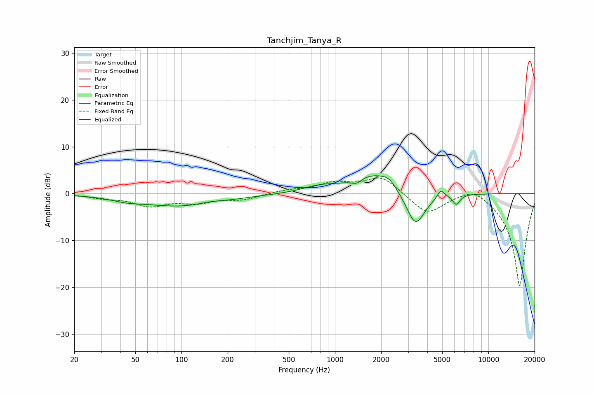

# Tanchjim_Tanya_R
See [usage instructions](https://github.com/jaakkopasanen/AutoEq#usage) for more options and info.

### Parametric EQs
Apply preamp of -3.9 dB when using parametric equalizer.

|   # | Type    |   Fc (Hz) |    Q |   Gain (dB) |
|-----|---------|-----------|------|-------------|
|   1 | Peaking |        44 | 1.46 |        -0.7 |
|   2 | Peaking |       101 | 0.52 |        -2.7 |
|   3 | Peaking |       152 | 1.77 |         0.5 |
|   4 | Peaking |       791 | 1.29 |         1.2 |
|   5 | Peaking |      1385 | 4.14 |        -1.1 |
|   6 | Peaking |      1768 | 1.02 |         4.1 |
|   7 | Peaking |      2251 | 2.98 |         1.5 |
|   8 | Peaking |      3348 | 2.26 |        -7.6 |
|   9 | Peaking |      4896 | 6    |         1.9 |
|  10 | Peaking |      6186 | 5.99 |        -2.1 |

### Fixed Band EQs
When using fixed band (also called graphic) equalizer, apply preamp of **-3.4 dB** (if available) and set gains manually with these parameters.

|   # | Type    |   Fc (Hz) |    Q |   Gain (dB) |
|-----|---------|-----------|------|-------------|
|   1 | Peaking |        31 | 1.41 |        -0.7 |
|   2 | Peaking |        62 | 1.41 |        -2.4 |
|   3 | Peaking |       125 | 1.41 |        -1.7 |
|   4 | Peaking |       250 | 1.41 |        -1.2 |
|   5 | Peaking |       500 | 1.41 |         0.7 |
|   6 | Peaking |      1000 | 1.41 |         2   |
|   7 | Peaking |      2000 | 1.41 |         3.7 |
|   8 | Peaking |      4000 | 1.41 |        -4.4 |
|   9 | Peaking |      8000 | 1.41 |         2.2 |
|  10 | Peaking |     16000 | 1.41 |       -20   |

### Graphs

