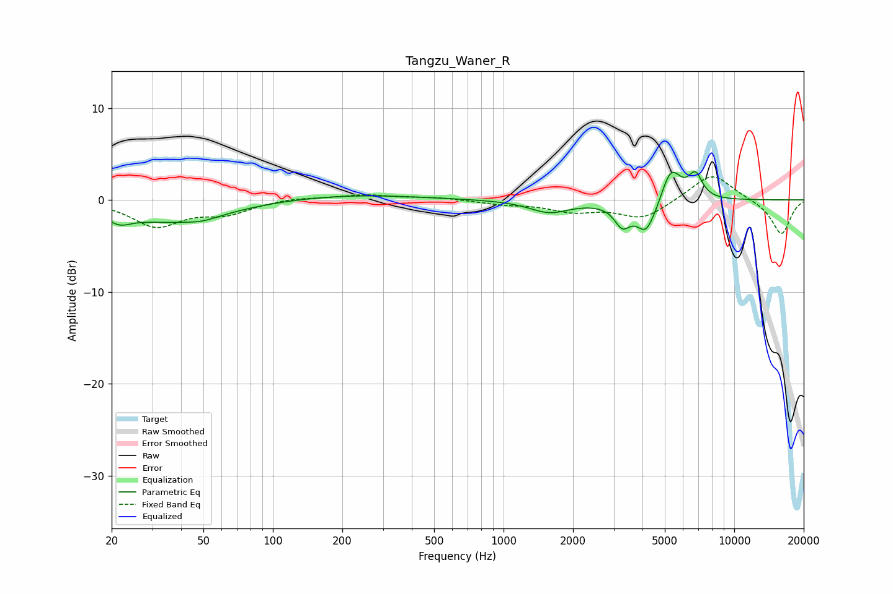

# Tangzu_Waner_R
See [usage instructions](https://github.com/jaakkopasanen/AutoEq#usage) for more options and info.

### Parametric EQs
Apply preamp of -3.2 dB when using parametric equalizer.

|   # | Type    |   Fc (Hz) |    Q |   Gain (dB) |
|-----|---------|-----------|------|-------------|
|   1 | Peaking |        22 | 2.81 |        -1.1 |
|   2 | Peaking |        36 | 0.58 |        -2.3 |
|   3 | Peaking |        50 | 2    |        -0.4 |
|   4 | Peaking |       213 | 0.48 |         0.6 |
|   5 | Peaking |      1580 | 1.63 |        -1.3 |
|   6 | Peaking |      3266 | 4.35 |        -2   |
|   7 | Peaking |      4122 | 5.25 |        -1   |
|   8 | Peaking |      4252 | 2.1  |        -3   |
|   9 | Peaking |      5295 | 3.03 |         4.3 |
|  10 | Peaking |      6787 | 4.5  |         2.6 |

### Fixed Band EQs
When using fixed band (also called graphic) equalizer, apply preamp of **-2.6 dB** (if available) and set gains manually with these parameters.

|   # | Type    |   Fc (Hz) |    Q |   Gain (dB) |
|-----|---------|-----------|------|-------------|
|   1 | Peaking |        31 | 1.41 |        -2.8 |
|   2 | Peaking |        62 | 1.41 |        -1.3 |
|   3 | Peaking |       125 | 1.41 |         0.3 |
|   4 | Peaking |       250 | 1.41 |         0.5 |
|   5 | Peaking |       500 | 1.41 |         0.3 |
|   6 | Peaking |      1000 | 1.41 |        -0.4 |
|   7 | Peaking |      2000 | 1.41 |        -1.1 |
|   8 | Peaking |      4000 | 1.41 |        -2   |
|   9 | Peaking |      8000 | 1.41 |         3   |
|  10 | Peaking |     16000 | 1.41 |        -3.8 |

### Graphs

