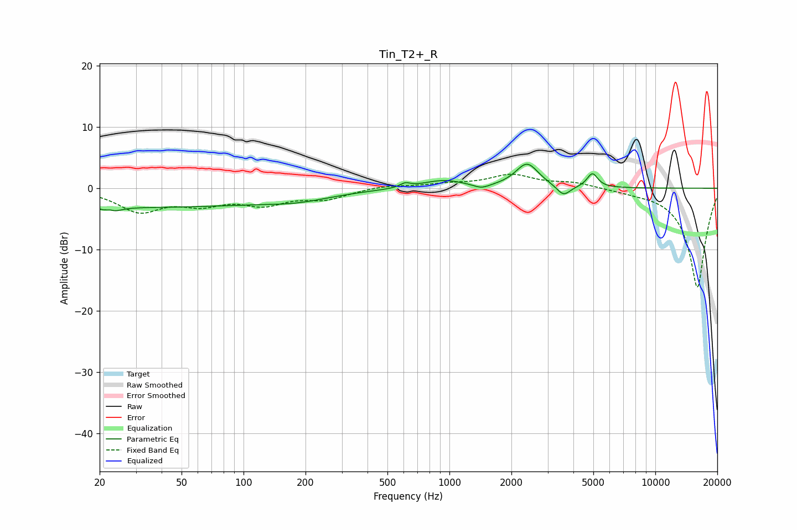

# Tin_T2+_R
See [usage instructions](https://github.com/jaakkopasanen/AutoEq#usage) for more options and info.

### Parametric EQs
Apply preamp of -4.0 dB when using parametric equalizer.

|   # | Type    |   Fc (Hz) |    Q |   Gain (dB) |
|-----|---------|-----------|------|-------------|
|   1 | Peaking |        22 | 5.44 |         2.6 |
|   2 | Peaking |        23 | 4.46 |        -3.2 |
|   3 | Peaking |        33 | 0.21 |        -3   |
|   4 | Peaking |       185 | 0.86 |        -1.1 |
|   5 | Peaking |       610 | 5.85 |         0.7 |
|   6 | Peaking |       935 | 1.38 |         1.3 |
|   7 | Peaking |      1431 | 3.45 |        -0.7 |
|   8 | Peaking |      2383 | 2.55 |         3.9 |
|   9 | Peaking |      3581 | 4.26 |        -1.8 |
|  10 | Peaking |      4947 | 5.44 |         2.3 |

### Fixed Band EQs
When using fixed band (also called graphic) equalizer, apply preamp of **-2.4 dB** (if available) and set gains manually with these parameters.

|   # | Type    |   Fc (Hz) |    Q |   Gain (dB) |
|-----|---------|-----------|------|-------------|
|   1 | Peaking |        31 | 1.41 |        -3.6 |
|   2 | Peaking |        62 | 1.41 |        -2.2 |
|   3 | Peaking |       125 | 1.41 |        -2.3 |
|   4 | Peaking |       250 | 1.41 |        -1.6 |
|   5 | Peaking |       500 | 1.41 |         0.5 |
|   6 | Peaking |      1000 | 1.41 |         0.6 |
|   7 | Peaking |      2000 | 1.41 |         2.1 |
|   8 | Peaking |      4000 | 1.41 |         0.9 |
|   9 | Peaking |      8000 | 1.41 |        -0.3 |
|  10 | Peaking |     16000 | 1.41 |       -16.3 |

### Graphs

