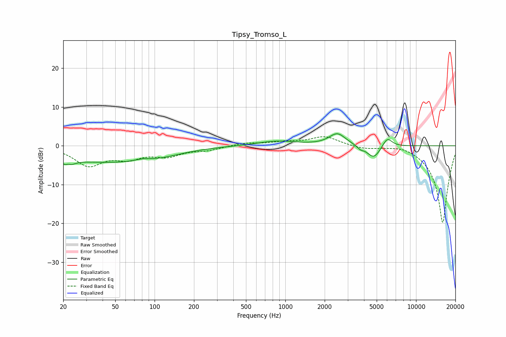

# Tipsy_Tromso_L
See [usage instructions](https://github.com/jaakkopasanen/AutoEq#usage) for more options and info.

### Parametric EQs
Apply preamp of -3.2 dB when using parametric equalizer.

|   # | Type    |   Fc (Hz) |    Q |   Gain (dB) |
|-----|---------|-----------|------|-------------|
|   1 | Peaking |        22 | 4.23 |        -4.4 |
|   2 | Peaking |        22 | 5.84 |         2.9 |
|   3 | Peaking |        40 | 0.35 |        -3.9 |
|   4 | Peaking |        81 | 2.19 |         0.7 |
|   5 | Peaking |       100 | 0.76 |        -1.1 |
|   6 | Peaking |       868 | 0.93 |         1.2 |
|   7 | Peaking |      2503 | 2.24 |         3.1 |
|   8 | Peaking |      3750 | 5.87 |        -0.8 |
|   9 | Peaking |      4745 | 2.73 |        -3.4 |
|  10 | Peaking |      6023 | 3.79 |         2.5 |

### Fixed Band EQs
When using fixed band (also called graphic) equalizer, apply preamp of **-2.4 dB** (if available) and set gains manually with these parameters.

|   # | Type    |   Fc (Hz) |    Q |   Gain (dB) |
|-----|---------|-----------|------|-------------|
|   1 | Peaking |        31 | 1.41 |        -4.8 |
|   2 | Peaking |        62 | 1.41 |        -2.7 |
|   3 | Peaking |       125 | 1.41 |        -2.3 |
|   4 | Peaking |       250 | 1.41 |        -1   |
|   5 | Peaking |       500 | 1.41 |         0.7 |
|   6 | Peaking |      1000 | 1.41 |         0.8 |
|   7 | Peaking |      2000 | 1.41 |         2.4 |
|   8 | Peaking |      4000 | 1.41 |        -0.8 |
|   9 | Peaking |      8000 | 1.41 |         0.8 |
|  10 | Peaking |     16000 | 1.41 |       -20   |

### Graphs

