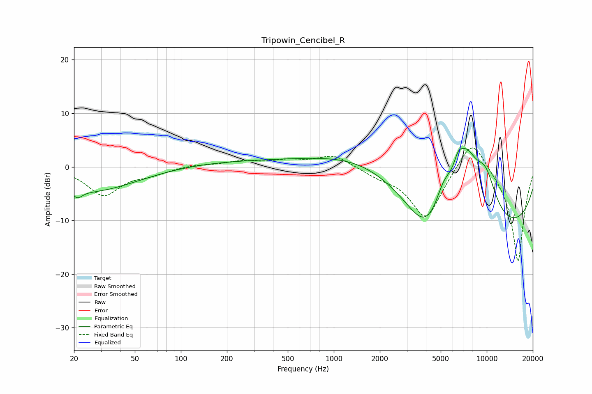

# Tripowin_Cencibel_R
See [usage instructions](https://github.com/jaakkopasanen/AutoEq#usage) for more options and info.

### Parametric EQs
Apply preamp of -3.5 dB when using parametric equalizer.

|   # | Type    |   Fc (Hz) |    Q |   Gain (dB) |
|-----|---------|-----------|------|-------------|
|   1 | Peaking |        21 | 4.64 |        -1.3 |
|   2 | Peaking |        25 | 0.46 |        -4.6 |
|   3 | Peaking |       449 | 0.18 |         1.3 |
|   4 | Peaking |      1684 | 0.51 |         3.5 |
|   5 | Peaking |      3994 | 1.21 |        -6.2 |
|   6 | Peaking |      5231 | 2.55 |         4.1 |
|   7 | Peaking |      6507 | 4.52 |         2.6 |
|   8 | Peaking |      7324 | 1.35 |        12.3 |
|   9 | Peaking |      9855 | 1.7  |         7   |
|  10 | Peaking |     10000 | 0.2  |       -12.9 |

### Fixed Band EQs
When using fixed band (also called graphic) equalizer, apply preamp of **-3.6 dB** (if available) and set gains manually with these parameters.

|   # | Type    |   Fc (Hz) |    Q |   Gain (dB) |
|-----|---------|-----------|------|-------------|
|   1 | Peaking |        31 | 1.41 |        -5.2 |
|   2 | Peaking |        62 | 1.41 |        -1.1 |
|   3 | Peaking |       125 | 1.41 |         0.4 |
|   4 | Peaking |       250 | 1.41 |         1   |
|   5 | Peaking |       500 | 1.41 |         1   |
|   6 | Peaking |      1000 | 1.41 |         2.3 |
|   7 | Peaking |      2000 | 1.41 |        -1.2 |
|   8 | Peaking |      4000 | 1.41 |        -9.7 |
|   9 | Peaking |      8000 | 1.41 |         6.6 |
|  10 | Peaking |     16000 | 1.41 |       -18   |

### Graphs

