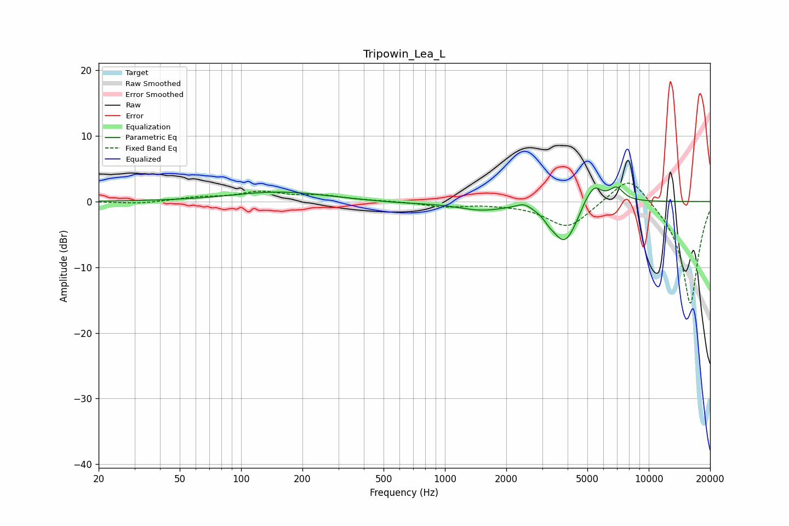

# Tripowin_Lea_L
See [usage instructions](https://github.com/jaakkopasanen/AutoEq#usage) for more options and info.

### Parametric EQs
Apply preamp of -2.3 dB when using parametric equalizer.

|   # | Type    |   Fc (Hz) |    Q |   Gain (dB) |
|-----|---------|-----------|------|-------------|
|   1 | Peaking |       155 | 0.61 |         1.5 |
|   2 | Peaking |       614 | 0.89 |        -0.2 |
|   3 | Peaking |      1504 | 1.24 |        -1.2 |
|   4 | Peaking |      2447 | 3.79 |         0.8 |
|   5 | Peaking |      3252 | 5.73 |        -0.6 |
|   6 | Peaking |      3812 | 2.43 |        -5.3 |
|   7 | Peaking |      4350 | 2.31 |        -2.3 |
|   8 | Peaking |      5049 | 2.16 |         3.4 |
|   9 | Peaking |      5462 | 5.49 |         1   |
|  10 | Peaking |      6952 | 3.92 |         1.9 |

### Fixed Band EQs
When using fixed band (also called graphic) equalizer, apply preamp of **-2.9 dB** (if available) and set gains manually with these parameters.

|   # | Type    |   Fc (Hz) |    Q |   Gain (dB) |
|-----|---------|-----------|------|-------------|
|   1 | Peaking |        31 | 1.41 |        -0.4 |
|   2 | Peaking |        62 | 1.41 |         0.6 |
|   3 | Peaking |       125 | 1.41 |         1.3 |
|   4 | Peaking |       250 | 1.41 |         0.8 |
|   5 | Peaking |       500 | 1.41 |         0.1 |
|   6 | Peaking |      1000 | 1.41 |        -0.7 |
|   7 | Peaking |      2000 | 1.41 |        -0.2 |
|   8 | Peaking |      4000 | 1.41 |        -4   |
|   9 | Peaking |      8000 | 1.41 |         4.5 |
|  10 | Peaking |     16000 | 1.41 |       -15.8 |

### Graphs

