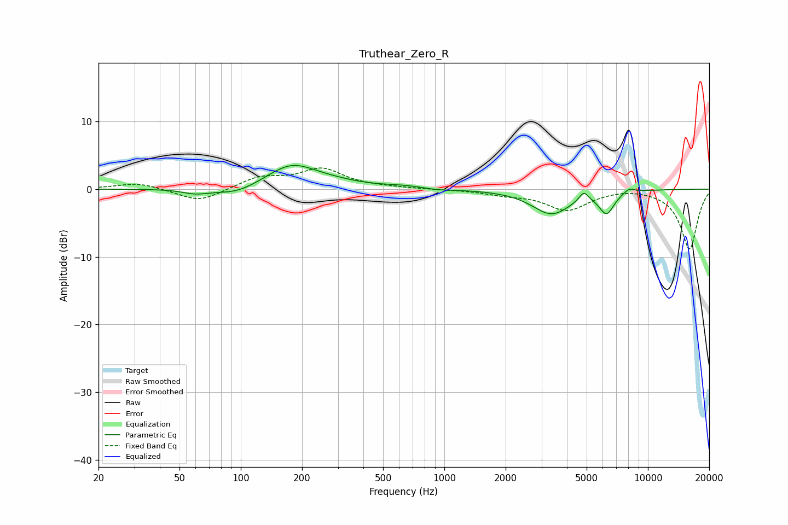

# Truthear_Zero_R
See [usage instructions](https://github.com/jaakkopasanen/AutoEq#usage) for more options and info.

### Parametric EQs
Apply preamp of -3.6 dB when using parametric equalizer.

|   # | Type    |   Fc (Hz) |    Q |   Gain (dB) |
|-----|---------|-----------|------|-------------|
|   1 | Peaking |        60 | 2.3  |        -0.6 |
|   2 | Peaking |        96 | 1.29 |        -1.2 |
|   3 | Peaking |       178 | 1.12 |         3.6 |
|   4 | Peaking |       293 | 1.13 |         0.5 |
|   5 | Peaking |       657 | 1.26 |         0.4 |
|   6 | Peaking |       905 | 1.61 |        -0.3 |
|   7 | Peaking |      3358 | 1.47 |        -3.6 |
|   8 | Peaking |      4841 | 5.98 |         1.4 |
|   9 | Peaking |      6266 | 3.71 |        -3.2 |
|  10 | Peaking |      8084 | 4.74 |         0.7 |

### Fixed Band EQs
When using fixed band (also called graphic) equalizer, apply preamp of **-3.2 dB** (if available) and set gains manually with these parameters.

|   # | Type    |   Fc (Hz) |    Q |   Gain (dB) |
|-----|---------|-----------|------|-------------|
|   1 | Peaking |        31 | 1.41 |         1   |
|   2 | Peaking |        62 | 1.41 |        -2   |
|   3 | Peaking |       125 | 1.41 |         1.7 |
|   4 | Peaking |       250 | 1.41 |         2.9 |
|   5 | Peaking |       500 | 1.41 |         0.1 |
|   6 | Peaking |      1000 | 1.41 |        -0   |
|   7 | Peaking |      2000 | 1.41 |        -0.6 |
|   8 | Peaking |      4000 | 1.41 |        -3   |
|   9 | Peaking |      8000 | 1.41 |         0.3 |
|  10 | Peaking |     16000 | 1.41 |        -8.9 |

### Graphs

