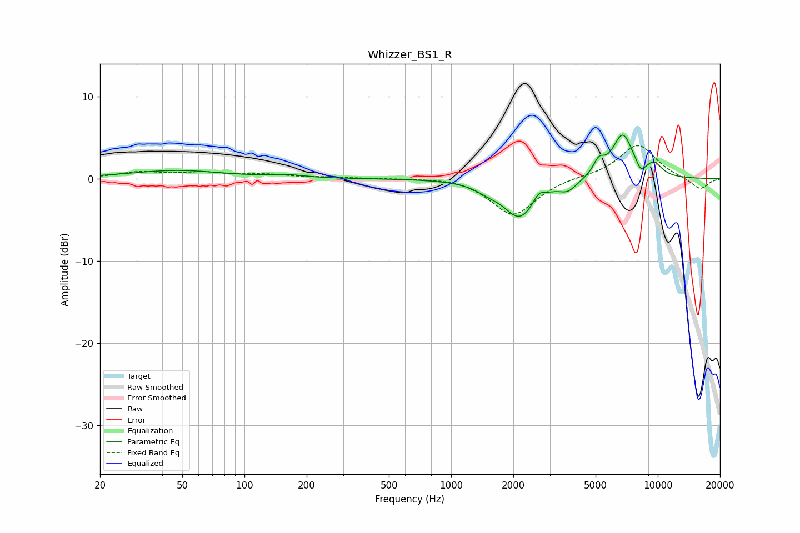

# Whizzer_BS1_R
See [usage instructions](https://github.com/jaakkopasanen/AutoEq#usage) for more options and info.

### Parametric EQs
Apply preamp of -5.4 dB when using parametric equalizer.

|   # | Type    |   Fc (Hz) |    Q |   Gain (dB) |
|-----|---------|-----------|------|-------------|
|   1 | Peaking |        47 | 0.64 |         1   |
|   2 | Peaking |       160 | 1.78 |         0.3 |
|   3 | Peaking |      1502 | 2.38 |        -0.7 |
|   4 | Peaking |      2144 | 1.82 |        -4.6 |
|   5 | Peaking |      2655 | 5.62 |         1   |
|   6 | Peaking |      3675 | 3.24 |        -1.2 |
|   7 | Peaking |      5187 | 5.15 |         1.7 |
|   8 | Peaking |      6763 | 2.66 |         5.3 |
|   9 | Peaking |      8276 | 5.97 |        -1.2 |
|  10 | Peaking |      9616 | 3.28 |         1.5 |

### Fixed Band EQs
When using fixed band (also called graphic) equalizer, apply preamp of **-4.1 dB** (if available) and set gains manually with these parameters.

|   # | Type    |   Fc (Hz) |    Q |   Gain (dB) |
|-----|---------|-----------|------|-------------|
|   1 | Peaking |        31 | 1.41 |         0.7 |
|   2 | Peaking |        62 | 1.41 |         0.6 |
|   3 | Peaking |       125 | 1.41 |         0.4 |
|   4 | Peaking |       250 | 1.41 |         0.1 |
|   5 | Peaking |       500 | 1.41 |         0   |
|   6 | Peaking |      1000 | 1.41 |         0.3 |
|   7 | Peaking |      2000 | 1.41 |        -4.5 |
|   8 | Peaking |      4000 | 1.41 |         0.2 |
|   9 | Peaking |      8000 | 1.41 |         4.2 |
|  10 | Peaking |     16000 | 1.41 |        -1.4 |

### Graphs

