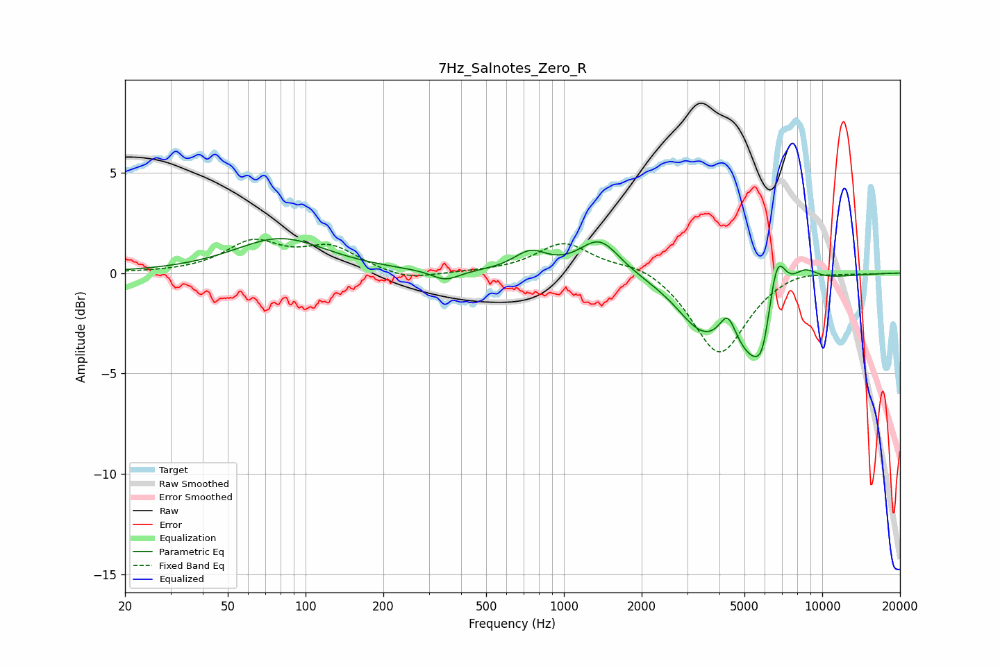

# 7Hz_Salnotes_Zero_R
See [usage instructions](https://github.com/jaakkopasanen/AutoEq#usage) for more options and info.

### Parametric EQs
Apply preamp of -1.8 dB when using parametric equalizer.

|   # | Type    |   Fc (Hz) |    Q |   Gain (dB) |
|-----|---------|-----------|------|-------------|
|   1 | Peaking |        80 | 0.8  |         1.7 |
|   2 | Peaking |       348 | 2.61 |        -0.5 |
|   3 | Peaking |       742 | 2.2  |         0.9 |
|   4 | Peaking |      1375 | 1.81 |         1.7 |
|   5 | Peaking |      3429 | 1.41 |        -2.2 |
|   6 | Peaking |      4306 | 4.58 |         1.3 |
|   7 | Peaking |      5595 | 1.54 |        -4.1 |
|   8 | Peaking |      5884 | 5.24 |        -1   |
|   9 | Peaking |      6660 | 3.71 |         3.4 |
|  10 | Peaking |      8477 | 2.36 |         1   |

### Fixed Band EQs
When using fixed band (also called graphic) equalizer, apply preamp of **-1.8 dB** (if available) and set gains manually with these parameters.

|   # | Type    |   Fc (Hz) |    Q |   Gain (dB) |
|-----|---------|-----------|------|-------------|
|   1 | Peaking |        31 | 1.41 |        -0   |
|   2 | Peaking |        62 | 1.41 |         1.5 |
|   3 | Peaking |       125 | 1.41 |         1.2 |
|   4 | Peaking |       250 | 1.41 |        -0.4 |
|   5 | Peaking |       500 | 1.41 |         0   |
|   6 | Peaking |      1000 | 1.41 |         1.5 |
|   7 | Peaking |      2000 | 1.41 |         0.5 |
|   8 | Peaking |      4000 | 1.41 |        -4.1 |
|   9 | Peaking |      8000 | 1.41 |         0.3 |
|  10 | Peaking |     16000 | 1.41 |        -0   |

### Graphs

